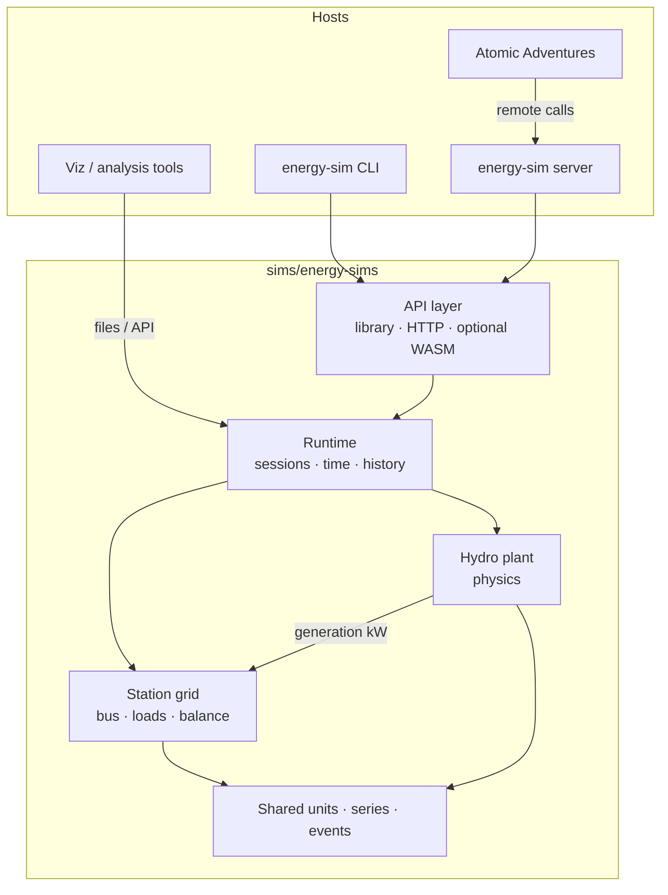
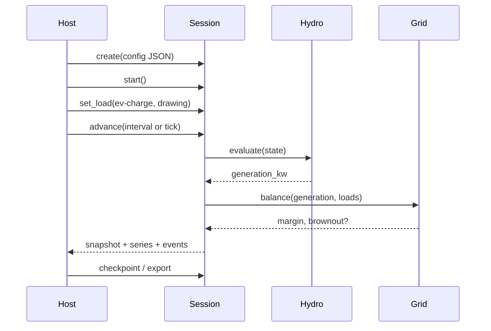

# Energy Simulation Engine Design

**Project:** Zanzibar's World of Energy / Atomic Adventures  
**Component:** Multi-source energy simulation engine (Stage 1: hydro + station grid)  
**Date:** 2026-07-29  
**Status:** Ready to build (revision 8 — relocated to energy-sims repo)  
**Repository:** [github.com/ZanzibarNuclear/energy-sims](https://github.com/ZanzibarNuclear/energy-sims)  
**Local path:** `sims/energy-sims/` (clone under atomic-ambitions monorepo `sims/`)

---

## Overview

We are building a **Rust energy simulation engine** that owns the calculation truth for power generation and for a local **station electrical grid**. Stage 1 delivers a solid hydro plant model plus a bus that sources feed into, so generation and demand can be balanced, monitored, and stressed (surplus, shortage, brownout).

The engine is **headless first**: configure with JSON, run from a CLI, advance simulation time, and capture operational history. Hosts (game control room, learning tools, future services) talk to it through clear APIs—ideally as a **remote service** once that is useful. Optional WASM remains a composition path for embedded clients, not the primary delivery model.

Existing prototypes in `welcome` and `atomic-adventures` are **inspiration only**. Stage 1 is a new foundation: modular, performant, and designed so solar, battery, fission, and fusion can join the same grid later.

---

## Background & Motivation

### What the game needs

In Part I of Atomic Adventures, Zanzibar restores a campus diversion plant on **Clearwater Run** (Clearwater Diversion). Hydro generation energizes the **utility station**, which powers outlets, appliances, holo-readers, EV charging, and lighting. Players should:

- Configure and run a hydro plant with real physical parameters (head, flow, penstock geometry, losses, efficiency).
- Feed generated power into a **local station grid**.
- Manage demand at the control-room console.
- See available power, load, margin, and brownout/shortage conditions.
- Keep per-instance configuration and operational history.

### Why a dedicated engine project

Teaching UIs and early game runtimes proved the core equation and the story shape. They also showed the limits of scattering physics across Vue components. A dedicated project under `sims/` gives us:

- One place for units, equations, and time advancement.
- Headless verification (CLI + files + tests).
- A clean multi-source and multi-load architecture.
- Freedom to evolve without being tied to prototype APIs.

### Inspiration (not standards)

| Source | Useful ideas |
| --- | --- |
| Welcome `HydroPowerSimulator.vue` | Interactive parameter exploration; plant scale intuition; \(P = \eta \rho g Q H_\mathrm{net}\) |
| Game hydro JS under `simulations/hydro/` | Facility state, events, console telemetry patterns |
| `docs/contracts/hydro-simulator.md` | Interval evaluation, event logs, sampling layers |
| `docs/contracts/station-electrical-grid.md` | Station bus, loads, balance, brownout vocabulary |
| `docs/contracts/control-panel.md` | Console presents telemetry; does not own physics |
| `sims/femlab-rs`, `isotope-explorer/nuclear-sim` | Pure Rust core + CLI / optional bindings patterns |

We draw vocabulary and teaching intent from these. We do **not** treat their numbers, function names, or control shapes as golden targets to match.

---

## Stage 1 goals

Stage 1 is complete when all of the following are true:

1. **Hydro physics** — Steady-state power from the key equation, with configuration for elevation drop (head), water flow, penstock geometry (length, diameter), friction and minor losses, turbine/generator efficiency, and related plant settings.
2. **Dynamic transitions** — Quantities such as turbine speed and delivered power **ramp** toward targets over configurable times (spin-up / spin-down), so graphs show a rise or fall rather than an instantaneous jump.
3. **Session lifecycle** — Create a simulation instance from JSON config; start; stop; run for a known interval; keep running and tick when duration is not known ahead of time.
4. **Station grid** — Generation feeds a local bus; loads draw from that bus; the engine reports supply, demand, surplus/deficit, and brownout/shortage state so the control room can monitor and the game can react.
5. **Operational data** — Capture and query current snapshot, energy totals, event log, and time series suitable for graphs and offline analysis (including file export).
6. **Headless usability** — Full Stage 1 workflows work via CLI with JSON config and optional persisted state/output files—no UI required.
7. **Integration path** — Documented API (library + CLI + preferred remote service shape: REST + WebSocket) so Atomic Adventures can call the engine from the control room and later from other hosts.

Later sources (solar, battery, fission, fusion) plug into the same **grid + session** model; Stage 1 implements hydro as the first generation source.

---

## Key Decisions

| # | Decision | Rationale |
| --- | --- | --- |
| D1 | **Repo: `energy-sims` at `sims/energy-sims/`** | GitHub [ZanzibarNuclear/energy-sims](https://github.com/ZanzibarNuclear/energy-sims); peers `femlab-rs` under `sims/`; room for hydro, grid, future sources. |
| D2 | **Headless engine first** | CLI + JSON + library prove correctness before any host UI. |
| D3 | **Station grid in Stage 1** | Power is only useful when it feeds loads; brownouts and “station alive” are product-critical. |
| D4 | **Primary host path: remote service** when integration starts; **library + CLI** always; **WASM optional** | Decouples game deploy from sim; multi-instance / multi-player ready; WASM only when embedding is better. |
| D5 | **JSON as configuration and interchange** | Easy CLI files, service payloads, fixtures, and tooling. |
| D6 | **Simulation time unit = seconds** (`sim_time_s: f64`) | SI-native, unambiguous; hosts convert game minutes/hours for display. |
| D7 | **Sources feed a bus; loads draw from it** | One balance model for hydro today and multi-source later. |
| D8 | **Hydro model is physics-parameterized** | Head, flow, penstock width/length, friction factors, η—not a single hard-coded plant. |
| D9 | **Files first for persistence; database later** | JSON checkpoint + CSV series (and JSONL events) from day one; SQL when the model is proven. |
| D10 | **Vue/game owns presentation and story outcomes** | Engine owns generation, grid balance, and telemetry truth. |
| D11 | **Prototype code is inspiration, not parity** | New types and APIs; no requirement to match existing JS function names or golden numbers. |
| D12 | **Remote API: REST for control + WebSocket for live telemetry** | Familiar request/response for config/commands; socket stream for console ticks without polling churn. |
| D13 | **Brownout is report-only in Stage 1** | Engine flags shortage/brownout; host may dim lights or warn. No automatic load shedding yet. |
| D14 | **Losses = short catalog of common causes with nominal coefficients** | Teaching-friendly, not deep fluid dynamics. |
| D15 | **Generic component params now; real-world catalog later** | Specs stay field-based; room to swap entire turbine/penstock/etc. packages from a product catalog (sponsorship). |
| D16 | **Ramp dynamics for physical state** | Open a valve → turbine spins up to the calculated operating point; close it → spins down. Same idea for delivered power and later heat sources. Transitions take longer than ~1 s (configurable). |

---

## Proposed Design

### Architecture



**Layers**

| Layer | Responsibility |
| --- | --- |
| **Core** | Units, constants, hydro power equation, loss models, telemetry/event types, series helpers |
| **Hydro plant** | Configured plant: stream/intake/penstock/turbine/generator → available generation |
| **Station grid** | Bus state, generation attachments, load registry, balance, brownout/shortage |
| **Runtime** | Session identity, sim clock, start/stop/interval/tick, history, checkpoints |
| **API** | Library surface, CLI, HTTP service, optional WASM bindings |
| **Persistence** | Save/load session state, config, operational log, export formats |

### Directory layout

```text
sims/energy-sims/              # https://github.com/ZanzibarNuclear/energy-sims
├── Cargo.toml
├── README.md
├── LICENSE
├── docs/
│   ├── design.md              # this document
│   ├── hydro-physics.md       # equations, parameters, units
│   ├── station-grid.md        # bus, loads, balance semantics
│   └── api.md                 # library, CLI, HTTP / WebSocket surface
├── crates/
│   ├── energy-sim-core/       # physics, types, pure evaluation
│   ├── energy-sim-runtime/    # sessions, time, ramps, history, grid
│   ├── energy-sim-cli/        # headless operator
│   ├── energy-sim-server/     # REST + WebSocket remote API
│   └── energy-sim-wasm/       # optional embed path
├── fixtures/                  # example plant + load configs (JSON)
└── examples/                  # sample runs, export samples
```

Workspace members grow as we build. Stage 1 prioritizes **core**, **runtime**, and **cli**; **server** lands as soon as remote integration is valuable; **wasm** only if a host wants in-process embedding.

### Hydro model

#### Core equation

\[
P_\mathrm{hydraulic} = \rho\, g\, Q\, H_\mathrm{net}
\]
\[
P_\mathrm{electrical} = \eta_\mathrm{turbine}\,\eta_\mathrm{generator}\, P_\mathrm{hydraulic}
\]
\[
H_\mathrm{net} = \max\bigl(0,\, H_\mathrm{gross} - H_\mathrm{loss}\bigr)
\]

Energy over an interval is the time-integral of electrical power (steady segments plus transitions when inputs change).

#### Configuration dimensions (Stage 1)

JSON plant configs should express at least:

| Parameter | Role |
| --- | --- |
| Gross head \(H_\mathrm{gross}\) | Elevation drop intake → turbine |
| Available / diverted flow \(Q\) | Stream and intake settings |
| Penstock length, diameter (width) | Geometry for loss and capacity intuition |
| Friction / minor loss factors | \(H_\mathrm{loss}\) contributions |
| Turbine & generator efficiencies | Overall \(\eta\) |
| Rated / design flow and power | Caps, warnings, teaching operating point |
| Optional fluid \(\rho\), \(g\) | Defaults for water on Earth; overridable |

Operator and environment inputs (gate openings, debris, leakage, stream availability, online/offline) adjust effective \(Q\), \(H_\mathrm{net}\), and whether power is delivered to the bus. Exact control vocabulary can evolve; physics remains the core.

#### Example plant config sketch (JSON)

```json
{
  "schemaVersion": 1,
  "kind": "hydro-plant",
  "id": "clearwater-diversion",
  "label": "Clearwater Diversion (Clearwater Run)",
  "stream": {
    "availableFlowM3s": 0.05
  },
  "penstock": {
    "grossHeadM": 25.0,
    "lengthM": 180.0,
    "diameterM": 0.25,
    "frictionFactor": 0.02,
    "minorLossCoefficient": 0.5
  },
  "turbine": {
    "efficiency": 0.75,
    "designFlowM3s": 0.04,
    "maxSafeFlowM3s": 0.06
  },
  "generator": {
    "efficiency": 0.92,
    "ratedPowerKw": 8.0
  },
  "fluid": {
    "densityKgM3": 1000.0,
    "gravityMs2": 9.80665
  }
}
```

#### Head-loss catalog (Stage 1)

Nothing deep—**named causes** with nominal coefficients the author can override. The engine sums contributions into \(H_\mathrm{loss}\) (and/or effective flow reduction where that is the better teaching model).

| Cause | What it represents | Nominal starting point (tunable) |
| --- | --- | --- |
| **Pipe friction** | Roughness / length / diameter of the penstock | `frictionFactor` on penstock (e.g. 0.015–0.03); loss scales with length and flow, falls with larger diameter |
| **Entrance / intake** | Trash rack, screen, entrance shape | Minor coefficient ~0.1–0.5 of velocity head, or fixed m of head at design flow |
| **Bends & fittings** | Elbows, valves, reducers | Minor coefficient ~0.2–1.0 total for a short mountain run |
| **Debris / screen clog** | Leaves, ice, silt (ops state) | Fraction of open area; maps to extra intake loss and/or reduced \(Q\) |
| **Leakage** | Penstock weep / bad joint (ops state) | Fraction of captured flow lost before turbine; optional small head penalty |
| **Elevation only (no extra loss)** | Ideal teaching case | All loss coeffs 0 → \(H_\mathrm{net} = H_\mathrm{gross}\) |

Exact formulas stay simple (engineering coefficients → meters of head). Authors pick from the catalog rather than inventing Reynolds-number models. A later pass can add a named optional model (e.g. Darcy–Weisbach) without changing session or grid APIs.

#### Steady targets vs dynamic state

Each evaluation step produces **targets** from the current configuration and operator inputs (e.g. target flow, target turbine speed, target electrical power given head and η). Physical machinery does not jump to those targets instantly.

| Concept | Role |
| --- | --- |
| **Target** | Instantaneous steady-state solution of the plant equations for current inputs |
| **Actual / displayed state** | What the session carries forward in time—ramps toward the target |
| **Ramp time** | Authorable duration (seconds) to approach the target after a step change in inputs |

Stage 1 hydro should at least ramp:

- **Turbine rotational speed** (rpm) — open admission → climb to operating speed; shut valve → decay toward zero  
- **Electrical power delivered** — follows speed / availability so the power graph rises and falls smoothly  

Later sources (e.g. nuclear heat) reuse the same pattern: target power or temperature + ramp-up / ramp-down time constants.

#### Component packages (later; design room now)

Configuration is **field-based** (generic specs). Later we introduce a **component catalog**: named real-world (or branded) packages that expand into those fields.

```text
Plant config today:
  turbine.efficiency, turbine.designFlowM3s, ...

Plant config later:
  turbine: { "packageId": "acme-micro-pelton-3kw" }
    → resolves to efficiency, design flow, rated head range, etc.
```

Examples of future packages: penstock pipe SKUs, micro-hydro turbines people actually buy, generator sets; for nuclear stages, a specific Gen IV / MSR design with real published parameters. Catalog entries can carry `vendor`, `displayName`, `sponsorshipTier` for product placement without baking sponsors into the physics core.

Stage 1 only needs:

- All physics expressed as **generic fields** (no hard-coded sole plant).
- Config documents may optionally include `packageId` / `catalogRef` **string fields** that are ignored until a resolver exists—or simply omit them until the catalog stage.
- No requirement to ship a real catalog or sponsorship pipeline in Stage 1.

### Station grid model

The station is more than a generator: it is a **local power grid** managed from the control room.

```text
  Hydro plant ──► generation (kW)
                      │
                      ▼
              ┌───────────────┐
   loads ───► │  station bus  │ ──► balance, surplus/deficit, brownout
              └───────────────┘
```

#### Concepts

| Concept | Meaning |
| --- | --- |
| **Bus** | Shared distribution for the facility (and later campus zones). Energized when generation (and later storage) can supply it under rules we define. |
| **Source attachment** | A generator (hydro first) contributing available power to the bus. |
| **Load** | Named demand with rating (W or kW) and state (off / armed / drawing). |
| **Balance** | Available generation vs total drawing load. |
| **Surplus / deficit** | Margin when supply > demand or shortfall when demand > supply. |
| **Brownout / shortage** | Engine-reported condition when deficit persists or exceeds thresholds—hosts decide presentation (dim lights, shed loads, warnings). |

#### Example load registry sketch (JSON)

```json
{
  "schemaVersion": 1,
  "kind": "station-grid",
  "id": "utility-station",
  "loads": [
    { "id": "lighting.main", "label": "Main building lights", "ratingW": 400, "priority": "normal" },
    { "id": "holo-reader.library", "label": "Library holo-reader", "ratingW": 80, "priority": "normal" },
    { "id": "ev-charge.port-1", "label": "EV charge port", "ratingW": 3500, "priority": "deferrable" },
    { "id": "kitchen.appliance", "label": "Kitchen outlet circuit", "ratingW": 1200, "priority": "normal" }
  ],
  "brownout": {
    "deficitThresholdW": 1,
    "policy": "report-only"
  }
}
```

Stage 1 grid behavior:

- Sum drawing loads vs available generation (from hydro and future sources).
- Report `availableGenerationKw`, `totalLoadKw`, `marginKw`, `busEnergized`, `status` (`ok` | `surplus` | `shortage` | `brownout`).
- Support load state changes over time as events so intervals reflect mid-run appliance use.
- **Brownout policy = report-only:** when demand exceeds supply (e.g. one too many blenders), the engine sets `gridStatus` / warnings so the host can dim lights or show an alarm. **No automatic load shedding** in Stage 1; finer gameplay response later.

This aligns with the spirit of `station-electrical-grid.md` without freezing implementation to current partial game code.

### Dynamic transitions (ramp-up / ramp-down)

Many physical components need a visible transition between idle and steady operation. Stage 1 builds this into the runtime so graphs and live consoles show **motion**, not step functions.

**Player-facing examples**

- Open a valve → turbine **spins up** to the calculated max for current head/flow over tens of seconds (or an authored duration)—not in one tick.  
- Close the valve → **spin-down** toward zero over a similar or different ramp time.  
- Delivered kW and bus generation track the ramping state so brownout timing feels fair when loads change mid-spin-up.

**Model (keep simple)**

```text
on each advance/tick of Δt seconds:
  target = steady_state_from_inputs(config, operator, environment)
  actual = approach(actual, target, Δt, ramp_up_s, ramp_down_s)
  emit sample(actual)   # graphs show the curve
```

Suggested Stage 1 approach: **linear ramp** (or exponential first-order lag) with separate **ramp-up** and **ramp-down** times per quantity. Defaults should feel longer than one second (e.g. turbine speed ~15–60 s to full; exact numbers are tuning knobs in plant config).

```json
{
  "turbine": {
    "efficiency": 0.75,
    "designFlowM3s": 0.04,
    "dynamics": {
      "speedRampUpS": 30,
      "speedRampDownS": 45,
      "powerRampUpS": 25,
      "powerRampDownS": 40
    }
  }
}
```

**Interval evaluation:** when advancing a long interval with mid-interval events (valve opens at \(t = 100\,\mathrm{s}\)), the engine integrates through the ramp—not only the final steady segment—so exported CSV shows the rise. Energy totals use **actual** power over time, not instantaneous jumps to target.

**Reuse later:** heat sources, reactor power, battery charge rate limits—all attach the same `dynamics` idea (target + ramp) without inventing a new session model.

### Session / runtime

A **session** is one running simulation instance: plant config(s), grid config, operator state, dynamic actuals, sim clock, history.

| Operation | Behavior |
| --- | --- |
| **Configure** | Load plant + grid JSON (files or API body). Validate units and required fields. |
| **Start** | Mark plant/source online path as running; begin accumulating energy when generation and bus rules allow. |
| **Stop** | Command targets toward offline; ramps bring actual speed/power down (unless emergency hard-stop is added later). |
| **Run interval** | Advance from \(t_0\) to \(t_1\) with optional mid-interval events; integrate ramps; return energy, samples, ending snapshot. |
| **Tick / continuous** | Advance by \(\Delta t\) when duration is open-ended (live ops, interactive sandbox); ramps progress each tick. |
| **Snapshot** | Current **actual** plant telemetry + targets (optional) + grid balance + sim time. |
| **History** | Query events and samples over a time range; export files (curves include transitions). |
| **Checkpoint** | Persist full session including dynamic state for resume mid-ramp. |

Simulation time is owned by the engine session and is always stored and advanced in **seconds** (`sim_time_s`). Hosts map game clocks (minutes, hours, days) or wall clock into \(\Delta t\) seconds when calling advance/tick.



### Operational data

Every meaningful change is an **event** (config load, start/stop, load change, threshold cross, brownout enter/exit). Samples capture continuous quantities for charts.

**Snapshot fields (illustrative)**

| Field | Unit | Notes |
| --- | --- | --- |
| `simTimeS` | s | Current simulation time (seconds from session epoch) |
| `flowM3s` | m³/s | Effective turbine flow |
| `grossHeadM` / `netHeadM` / `headLossM` | m | Head breakdown |
| `hydraulicPowerKw` / `electricalPowerKw` | kW | **Actual** (ramped) plant output |
| `targetElectricalPowerKw` | kW | Optional: steady-state target for teaching/debug |
| `energyGeneratedKwh` | kWh | Cumulative this session or interval |
| `availableGenerationKw` | kW | Into the bus |
| `totalLoadKw` | kW | Drawing loads |
| `marginKw` | kW | Generation − load |
| `busEnergized` | bool | Facility power available |
| `gridStatus` | enum | ok / surplus / shortage / brownout |
| `warnings` / `faults` | list | Operator-facing codes |

**File formats (Stage 1)**

| Artifact | Format | Role |
| --- | --- | --- |
| Session checkpoint | **JSON** | Config + operator/grid state + `simTimeS` + summary; resume a run |
| Event log | **JSONL** (one event per line) | Append-friendly narrative of changes |
| Operational series | **CSV** | Time series for spreadsheets, notebooks, and viz tools |
| Optional full dump | **JSON** | One-shot export of samples when tools prefer a single file |

**CSV series columns (illustrative):** `sim_time_s`, `electrical_power_kw`, `flow_m3s`, `net_head_m`, `available_generation_kw`, `total_load_kw`, `margin_kw`, `grid_status`, …

Database-backed storage is expected soon after the model settles through trial and error; Stage 1 does not block on it.

### API surfaces

#### Library (Rust)

Public, stable-enough Stage 1 entry points (names illustrative):

```rust
// Create and configure
Session::from_json(config: &str) -> Result<Session>;
Session::load_checkpoint(path_or_bytes) -> Result<Session>;

// Lifecycle — durations are always in seconds (or Duration from secs)
session.start()?;
session.stop()?;
session.advance_secs(dt_s: f64) -> Result<AdvanceReport>;  // known interval
session.tick_secs(dt_s: f64) -> Result<Snapshot>;          // open-ended step

// Inspection
session.snapshot() -> Snapshot;
session.query_history(range) -> HistoryView;
session.export_series(path, format)?;
session.save_checkpoint(path)?;

// Commands
session.apply(Command::SetLoad { id, drawing: true })?;
session.apply(Command::SetHydroInput { .. })?;
```

Exact command enums and DTO shapes live in `docs/api.md` as they stabilize during implementation.

#### CLI

Headless operator for development, CI, and offline scenarios:

```bash
# Evaluate a static plant config (no session clock)
energy-sim hydro eval --config plant.json

# Create a session, run 3600 s of sim time, write outputs
energy-sim session run \
  --config station.json \
  --duration-secs 3600 \
  --out-dir ./run-001/
# writes: checkpoint.json, events.jsonl, series.csv

# Resume and continue another 1800 s
energy-sim session resume \
  --checkpoint ./run-001/checkpoint.json \
  --duration-secs 1800

# Export / re-export series for plotting
energy-sim session export \
  --checkpoint ./run-001/checkpoint.json \
  --format csv \
  --out series.csv

# Show current balance
energy-sim session status --checkpoint ./run-001/checkpoint.json
```

`station.json` may compose plant + grid + initial load states in one document or reference multiple files. CLI may accept human-friendly duration flags later (`--duration 1h`) that convert to seconds; the engine itself always works in seconds.

#### Remote service (preferred game integration path)

When the game (or other clients) should not embed the engine, use **REST for control** and **WebSocket for live telemetry**.

**Why this split (recommendation):**

| Concern | Fit |
| --- | --- |
| Create session, load config, advance a known interval, checkpoint, one-shot status | **REST** — simple, cacheable, easy to debug with curl, natural for CLI-like and admin tools |
| Control-room live graphs while the panel is open | **WebSocket** — server pushes snapshots/samples on each tick; no polling storm; bidirectional commands if we want them on the same socket |
| SSE (Server-Sent Events) | One-way server→client over HTTP; fine for “subscribe to metrics” only. We skip it as the primary live path because the console also **sends** commands (loads, start/stop); WebSocket covers both directions cleanly. REST + SSE is a fallback if WS is painful in a given host. |

**Sketch**

| Capability | Protocol |
| --- | --- |
| Create session | `POST /v1/sessions` body: config JSON → `sessionId` |
| Get snapshot | `GET /v1/sessions/{id}` |
| Advance interval | `POST /v1/sessions/{id}/advance` `{ "durationSecs": 3600, "events": [...] }` |
| Commands | `POST /v1/sessions/{id}/commands` (or WS message) |
| History / export | `GET /v1/sessions/{id}/history?fromSecs=&toSecs=` · download CSV |
| Checkpoint | `POST /v1/sessions/{id}/checkpoint` · file download |
| Live ops | `WS /v1/sessions/{id}/live` — subscribe; receive `snapshot` / `sample` messages; optional command messages |

Auth, multi-tenancy, and deploy topology can be chosen when we stand the service up (local process for alpha, then shared host as needed). The game control room becomes a **client** of this API: it displays telemetry and sends load/generation commands; it does not reimplement physics.

#### Optional WASM

Available for hosts that want in-process computation (lightweight teaching pages, offline demos). Same core types as the library; not required for Atomic Adventures if the remote path is healthy.

### Persistence

Stage 1 needs durable **config**, **operational history**, and **current sim time** (`sim_time_s`) for real sessions.

| Approach | Stage | Use |
| --- | --- | --- |
| **JSON checkpoint** | Stage 1 from day one | Resume runs; share scenarios |
| **CSV operational series** | Stage 1 from day one | Graphs, notebooks, sponsorship demos of “real plant data” |
| **JSONL event log** | Stage 1 from day one | Append-only narrative |
| **Database (e.g. SQLite / Postgres)** | Soon after model stabilizes | Queryable multi-session store for the server; not a Stage 1 blocker |
| **Host-owned game save** | Integration | Mirror flags (`power online`, brownout) while fidelity lives in sim files/service |

Trial-and-error on the physics and grid model happens against files first; we introduce a DB once shapes stop thrashing.

### Host integration (Atomic Adventures)

#### Control room console

- Subscribes to or polls **generation + grid** snapshots.
- Charts operational series; shows available power, load, margin, brownout.
- Sends commands: load circuits on/off, hydro operator inputs, start/stop.
- Does not compute \(P = \eta\rho gQH\); it presents engine truth.

#### Facility gameplay

- Outlets, appliances, EV charging, lights depend on **bus energized** and local switch/armed state (game/world) while **ratings and balance** come from the grid model (engine or engine-backed host service).
- Brownouts and shortages are simulation outcomes the game can dramatize.

#### Learning / sandbox

- Same hydro + grid engine with sandbox configs (vary head, diameter, flow, friction live).
- Early teaching UIs in the monorepo can remain as-is; new experiences should call the engine rather than reimplement physics.

### Multi-source foundation

Stage 1 implements **hydro** as the first `Source`. The grid accepts **available power from N sources**:

```text
Source trait (conceptual)
  id, kind, available_power_kw(at sim_time_s / state) -> f64
  apply_command / event as needed
```

Hydro is fully implemented. Solar, battery, fission, and fusion later implement the same attachment to the bus without redesigning session or console integration.

### Real-world components & sponsorship (later stages)

The same pattern as multi-source: **generic fields now**, **named packages later**.

| Layer | Role |
| --- | --- |
| Physics fields | Always the source of truth for the engine |
| Catalog package | Maps a public product (or fictionalized real design) → field set |
| Game / shop UX | Player or author picks “Acme Pelton 3 kW” instead of typing η and design flow |
| Business | Vendor placement, sponsored scenarios, paid catalog slots |

Applies beyond hydro: e.g. Gen IV MSR based on a real molten-salt design with that company’s parameters and prominence. Stage 1 leaves `packageId` / catalog hooks optional on config objects so we do not paint ourselves into anonymous-only configs.

---

## Testing strategy

| Kind | Intent |
| --- | --- |
| Unit tests | Power equation, loss catalog, balance/brownout **reporting**, ramp approach math |
| Scenario tests | JSON fixtures: valve open → spin-up curve; valve close → spin-down; drought flow; high load EV charge |
| CLI integration | Config in → `checkpoint.json` + `series.csv` + `events.jsonl` out |
| Property / bounds | Non-negative head/power; energy consistency over split intervals |
| Service tests | When server lands: REST create/advance/command; WS live stream |

Tests define **engine correctness** from physics and authored scenarios—not from matching legacy prototype outputs.

---

## Rollout

1. **Scaffold** workspace + docs stubs.  
2. **Core hydro** evaluation from JSON config (loss catalog included).  
3. **Runtime session** start/stop/interval/tick in **seconds**, **ramp dynamics**, CSV/JSONL export.  
4. **Station grid** loads and balance; report-only brownout.  
5. **CLI** complete headless workflow + fixtures/examples.  
6. **File persistence** hardened (checkpoint resume); DB when ready.  
7. **Server** REST control + WebSocket live.  
8. **Game client** control room as remote client; brownout presentation (e.g. dim lights).  
9. **Optional WASM** if a host needs in-process.  
10. **Later:** component catalog + real-world / sponsored packages; multi-source plants.

---

## Risks

| Risk | Severity | Mitigation |
| --- | --- | --- |
| Report-only brownout feels weak in play | Low | Host-side presentation (dimming) is enough for Stage 1; shed later |
| Loss catalog too coarse for enthusiasts | Low | Nominal table + overrides; optional deeper model later |
| WebSocket ops complexity | Medium | REST works alone for batch/CLI; WS only for live console |
| File scale limits multi-player server | Medium | Expected; migrate to DB after schema stabilizes |
| Catalog/sponsorship delayed forever | Low | Keep generic fields + optional `packageId` hooks from the start |

---

## Resolved decisions (was open questions)

| # | Question | Decision |
| --- | --- | --- |
| 1 | Sim time unit | **Seconds** (`sim_time_s`) |
| 2 | Brownout policy | **Report-only** (flag shortage/brownout; host presents dimming etc.) |
| 3 | Friction / losses | **Short catalog of common causes** with nominal coefficients; not deep CFD |
| 4 | Server protocol | **REST for control + WebSocket for live telemetry** (SSE not primary) |
| 5 | Persistence | **Files from the start** (JSON checkpoint, CSV series, JSONL events); **database soon after** the model settles |
| 6 | Live API | **REST** for control/config; **WebSocket** for live stats (confirmed) |
| 7 | Dynamics | **Ramp-up / ramp-down** for turbine speed and power (and reusable later for heat sources) |

---

## Key Decisions (summary)

1. New foundation under `sims/energy-sims/` ([ZanzibarNuclear/energy-sims](https://github.com/ZanzibarNuclear/energy-sims))—not a rewrite of prototype simulators.  
2. Stage 1 = hydro physics + **ramps** + session lifecycle + **station grid** + operational data + headless CLI.  
3. Sim time in **seconds**; brownout **report-only**; losses via a **simple cause catalog**.  
4. Remote path: **REST + WebSocket**; files first (**CSV** series), DB next.  
5. Generic component specs now; **real-world / sponsored packages** later on the same fields.  
6. Multi-source ready via grid attachments; only hydro is built in Stage 1.  
7. Graphs show **transitions** (spin-up / spin-down), not only steady state.

---

## References

- `atomic-adventures/docs/contracts/hydro-simulator.md`  
- `atomic-adventures/docs/contracts/station-electrical-grid.md`  
- `atomic-adventures/docs/contracts/control-panel.md`  
- `atomic-adventures/docs/contracts/holo-reader.md`  
- `atomic-adventures/game-design/content/subject-matter/hydro-simulation.md`  
- `atomic-adventures/game/src/lib/simulations/hydro/` (prototype)  
- `welcome/app/components/simulators/HydroPowerSimulator.vue` (prototype)  
- `sims/femlab-rs/`  
- `isotope-explorer/crates/nuclear-sim`

---

## PR Plan

Incremental, each mergeable on its own. Order can flex if grid and hydro develop in parallel after PR1.

### PR1 — Scaffold workspace  
- **Title:** `chore: scaffold energy-sims Cargo workspace`  
- **Affects:** repo root Cargo workspace, empty crates (`energy-sim-core`, `energy-sim-runtime`, `energy-sim-cli`), README, docs stubs, licenses  
- **Depends on:** none  
- **Description:** Workspace builds with `cargo metadata` / empty lib stubs; fixtures directory; optional CI smoke.

### PR2 — Hydro core evaluation  
- **Title:** `feat(energy-sim): hydro power equation and plant config JSON`  
- **Affects:** `energy-sim-core` (units, loss catalog, \(P\), config types), fixtures, `docs/hydro-physics.md`  
- **Depends on:** PR1  
- **Description:** Given plant JSON, compute net head, hydraulic and electrical power for varied head, flow, diameter, and catalog losses/η. Optional unused `packageId` fields allowed on components.

### PR3 — Session lifecycle, ramps, and history  
- **Title:** `feat(energy-sim): session time, ramp dynamics, and operational log`  
- **Affects:** `energy-sim-runtime` (session, dynamics/ramp helper, events/samples), checkpoint + CSV/JSONL export  
- **Depends on:** PR2  
- **Description:** Time advancement in **seconds**; target vs actual state; spin-up/spin-down for speed and power; energy uses actual power; event log; snapshot API; `series.csv` shows curves through transitions.

### PR4 — Station grid and balance  
- **Title:** `feat(energy-sim): station bus, loads, surplus/shortage/brownout report`  
- **Affects:** `energy-sim-runtime` grid module, load registry JSON, `docs/station-grid.md`  
- **Depends on:** PR3  
- **Description:** Hydro generation attaches to bus; loads draw; **report-only** brownout/shortage in snapshots (no auto-shed).

### PR5 — CLI headless workflows  
- **Title:** `feat(energy-sim): CLI eval, session run, export, status`  
- **Affects:** `energy-sim-cli`, examples  
- **Depends on:** PR4  
- **Description:** File-driven config; run intervals in seconds; write `checkpoint.json`, `events.jsonl`, and `series.csv`.

### PR6 — Persistence hardening  
- **Title:** `feat(energy-sim): durable checkpoints and history packaging`  
- **Affects:** runtime file I/O, CLI resume  
- **Depends on:** PR5  
- **Description:** Reliable save/load of config, `sim_time_s`, and operational files. DB left for a follow-on once shapes stabilize.

### PR7 — Remote service  
- **Title:** `feat(energy-sim): REST session API + WebSocket live channel`  
- **Affects:** `energy-sim-server`, `docs/api.md`  
- **Depends on:** PR4 (minimum); ideally PR6  
- **Description:** REST for create/advance/commands/checkpoint; WebSocket for live snapshot/sample stream—game-ready remote path.

### PR8 — Game control-room client  
- **Title:** `feat(atomic-adventures): control room consumes energy-sim service`  
- **Affects:** game console wiring, service URL, facility load hooks as available  
- **Depends on:** PR7  
- **Description:** Live monitor of generation and grid margin; load commands; present brownout (e.g. dim lights). Leave legacy prototypes in place.

### PR9 — Optional WASM package  
- **Title:** `feat(energy-sim): optional WASM bindings for embedded hosts`  
- **Affects:** `energy-sim-wasm`  
- **Depends on:** PR3–PR4  
- **Description:** Same core for hosts that prefer in-process; not required for main game path.

### Later (not Stage 1 ship, but designed for)

| Item | Notes |
| --- | --- |
| Database session store | After file-based model is stable |
| Component catalog resolver | Real turbines, penstock SKUs, sponsored packages → field expansion |
| Multi-source plants | Solar, battery, fission, fusion on the same bus |
| Auto load-shed policies | When gameplay needs more than report-only brownout |

---

*End of design document (revision 8).*
