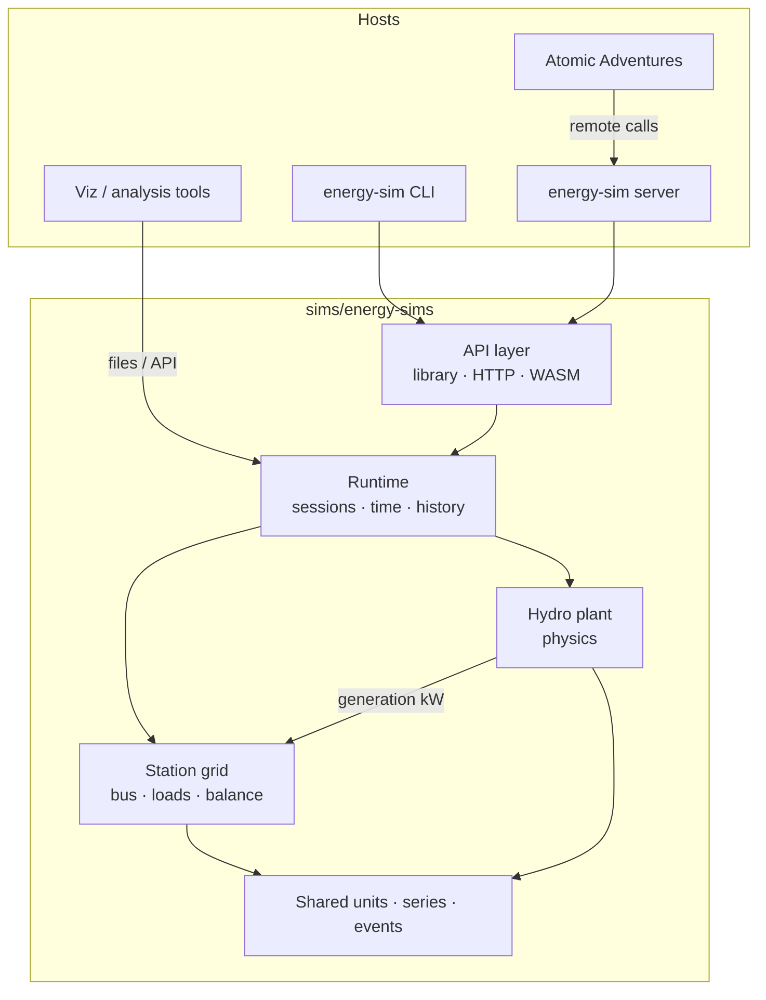
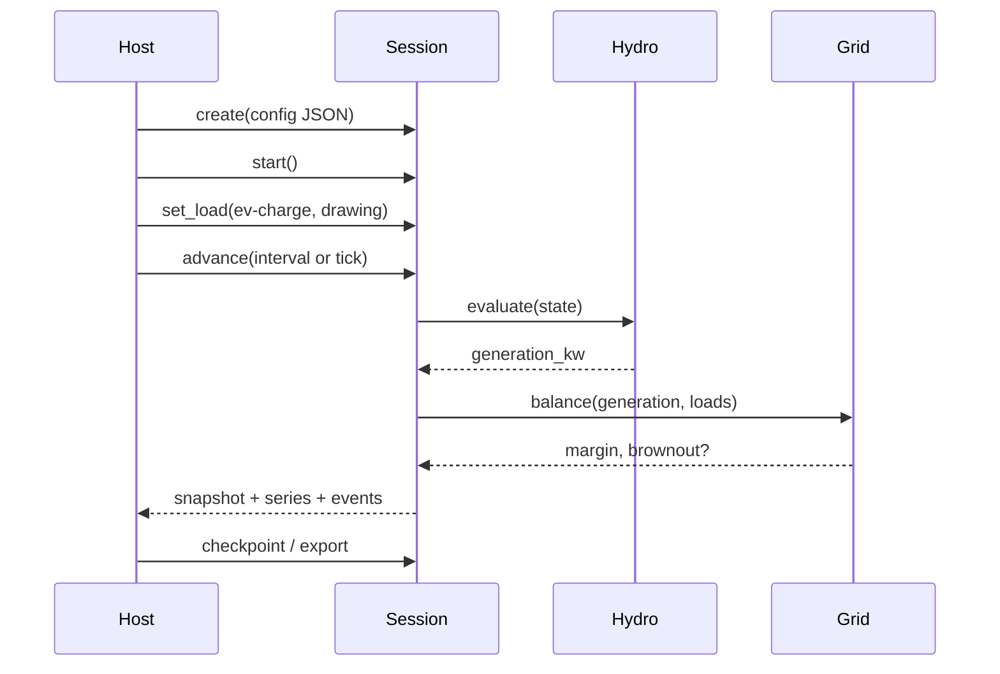
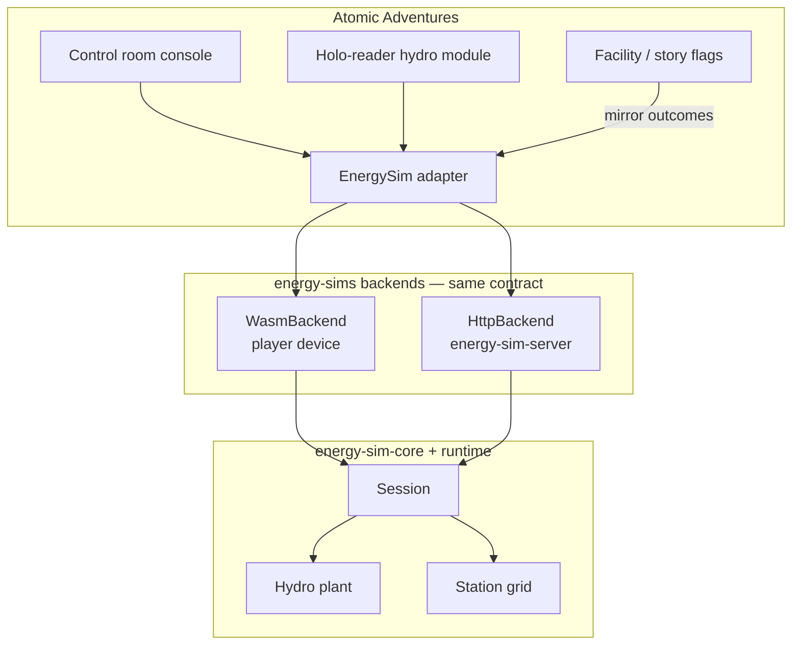

# Energy Simulation Engine Design

**Project:** Zanzibar's World of Energy / Atomic Adventures  
**Component:** Multi-source energy simulation engine (Stage 1: hydro + station grid)  
**Date:** 2026-08-04  
**Status:** Stage 1 engine + hydro config lab MVP complete (revision 10 — game integration design)  
**Repository:** [github.com/ZanzibarNuclear/energy-sims](https://github.com/ZanzibarNuclear/energy-sims)  
**Local path:** `sims/energy-sims/` (clone under atomic-ambitions monorepo `sims/`)  
**Plans:** remaining work in [`docs/plans/next.md`](plans/next.md)

---

## Overview

We are building a **Rust energy simulation engine** that owns the calculation truth for power generation and for a local **station electrical grid**. Stage 1 delivers a solid hydro plant model plus a bus that sources feed into, so generation and demand can be balanced, monitored, and stressed (surplus, shortage, brownout).

The engine is **headless first**: configure with JSON, run from a CLI, advance simulation time, and capture operational history. Hosts (game control room, holo-reader lessons, designer tools) talk to it through a **stable session contract**—the same create / start / advance / command / snapshot surface—whether the backend runs **in-process via WASM** (short-term game deploy) or as a **remote REST + WebSocket service** (later hosted logic).

The **hydro config lab** (`apps/hydro-config-lab/`) is the stand-alone authoring and trial UI against the production engine. It is the primary tool for Clearwater tuning and for discovering which controls belong in the player-facing holo-reader.

Existing prototypes in `welcome` and `atomic-adventures` are **inspiration only**. Stage 1 is a new foundation: modular, performant, and designed so solar, battery, fission, and fusion can join the same grid later. Legacy in-game hydro JS is retired on the game side once the energy-sims path is the default.

---

## Background & Motivation

### What the game needs

In Part I of Atomic Adventures, Zanzibar restores a campus diversion plant on **Clearwater Run** (Clearwater Diversion). Hydro generation energizes the **utility station**, which powers outlets, appliances, holo-readers, EV charging, and lighting. Players should:

- Configure and run a hydro plant with real physical parameters (head, flow, penstock geometry, losses, efficiency).
- Feed generated power into a **local station grid**.
- Manage demand at the control-room console.
- See available power, load, margin, and brownout/shortage conditions.
- Keep per-instance configuration and operational history.

### Why a dedicated engine project

Teaching UIs and early game runtimes proved the core equation and the story shape. They also showed the limits of scattering physics across Vue components. A dedicated project under `sims/` gives us:

- One place for units, equations, and time advancement.
- Headless verification (CLI + files + tests).
- A clean multi-source and multi-load architecture.
- Freedom to evolve without being tied to prototype APIs.

### Inspiration (not standards)

| Source | Useful ideas |
| --- | --- |
| Welcome `HydroPowerSimulator.vue` | Interactive parameter exploration; plant scale intuition; \(P = \eta \rho g Q H_\mathrm{net}\) |
| Game hydro JS under `simulations/hydro/` | Facility state, events, console telemetry patterns |
| `docs/contracts/hydro-simulator.md` | Interval evaluation, event logs, sampling layers |
| `docs/contracts/station-electrical-grid.md` | Station bus, loads, balance, brownout vocabulary |
| `docs/contracts/control-panel.md` | Console presents telemetry; does not own physics |
| `sims/femlab-rs`, `isotope-explorer/nuclear-sim` | Pure Rust core + CLI / optional bindings patterns |

We draw vocabulary and teaching intent from these. We do **not** treat their numbers, function names, or control shapes as golden targets to match.

---

## Stage 1 goals

Stage 1 is **implemented**. Acceptance criteria (all met in this repo):

1. **Hydro physics** — Steady-state power from the key equation, with configuration for elevation drop (head), water flow, penstock geometry (length, diameter), friction and minor losses, turbine/generator efficiency, and related plant settings. (`energy-sim-core`)
2. **Dynamic transitions** — Turbine speed and delivered power **ramp** toward targets over configurable times (spin-up / spin-down). (`energy-sim-runtime` dynamics)
3. **Session lifecycle** — Create from JSON; start; stop; advance interval; tick; snapshot. (`Session`)
4. **Station grid** — Generation feeds a local bus; loads draw; surplus/deficit and report-only brownout/shortage. (`StationGrid`)
5. **Operational data** — Snapshot, energy totals, events, series; JSON checkpoint + CSV + JSONL export.
6. **Headless usability** — CLI: `hydro eval`, `session run` / `resume` / `export` / `status`.
7. **Integration path** — Library + CLI + REST/WebSocket server + WASM + JS client sketch (`clients/js/`).

Later sources (solar, battery, fission, fusion) plug into the same **grid + session** model; Stage 1 implements hydro as the first generation source.

**Shipped after Stage 1 foundation:** interactive **hydro config lab** MVP (site layout, equipment, calculations, engine-backed trials, save/export). See [hydro-config-lab.md](hydro-config-lab.md).

**Still outstanding** (single plan: [`docs/plans/next.md`](plans/next.md)): game-ready WASM session API, richer grid presentation for the control console, Clearwater fixture workflow, then Atomic Adventures integration (control room + holo-reader) and removal of legacy hydro prototypes. Deferred: database session store, component catalog, multi-source plants, auto load-shed.

---

## Key Decisions

| # | Decision | Rationale |
| --- | --- | --- |
| D1 | **Repo: `energy-sims` at `sims/energy-sims/`** | GitHub [ZanzibarNuclear/energy-sims](https://github.com/ZanzibarNuclear/energy-sims); peers `femlab-rs` under `sims/`; room for hydro, grid, future sources. |
| D2 | **Headless engine first** | CLI + JSON + library prove correctness before any host UI. |
| D3 | **Station grid in Stage 1** | Power is only useful when it feeds loads; brownouts and “station alive” are product-critical. |
| D4 | **Session contract first; dual transport** — **WASM embed for short-term game alpha** (runs on the player device); **REST + WebSocket server** when we host shared logic. Library + CLI always. | Same create/start/advance/command/snapshot API; swap backend without rewriting the console or holo-reader. WASM unblocks deploy without a game sim server. |
| D5 | **JSON as configuration and interchange** | Easy CLI files, service payloads, fixtures, and tooling. |
| D6 | **Simulation time unit = seconds** (`sim_time_s: f64`) | SI-native, unambiguous; hosts convert game minutes/hours for display. |
| D7 | **Sources feed a bus; loads draw from it** | One balance model for hydro today and multi-source later. |
| D8 | **Hydro model is physics-parameterized** | Head, flow, penstock width/length, friction factors, η—not a single hard-coded plant. |
| D9 | **Files first for persistence; database later** | JSON checkpoint + CSV series (and JSONL events) from day one; SQL when the model is proven. |
| D10 | **Vue/game owns presentation and story outcomes** | Engine owns generation, grid balance, and telemetry truth. |
| D11 | **Prototype code is inspiration, not parity** | New types and APIs; no requirement to match existing JS function names or golden numbers. |
| D12 | **Remote API: REST for control + WebSocket for live telemetry** | Familiar request/response for config/commands; socket stream for console ticks without polling churn. |
| D13 | **Brownout is report-only in Stage 1** | Engine flags shortage/brownout; host may dim lights or warn. No automatic load shedding yet. |
| D14 | **Losses = short catalog of common causes with nominal coefficients** | Teaching-friendly, not deep fluid dynamics. |
| D15 | **Generic component params now; real-world catalog later** | Specs stay field-based; room to swap entire turbine/penstock/etc. packages from a product catalog (sponsorship). |
| D16 | **Ramp dynamics for physical state** | Open a valve → turbine spins up to the calculated operating point; close it → spins down. Same idea for delivered power and later heat sources. Transitions take longer than ~1 s (configurable). |

---

## Proposed Design

### Architecture



**Layers**

| Layer | Responsibility |
| --- | --- |
| **Core** | Units, constants, hydro power equation, loss models, telemetry/event types, series helpers |
| **Hydro plant** | Configured plant: stream/intake/penstock/turbine/generator → available generation |
| **Station grid** | Bus state, generation attachments, load registry, balance, brownout/shortage |
| **Runtime** | Session identity, sim clock, start/stop/interval/tick, history, checkpoints |
| **API** | Library surface, CLI, HTTP service, WASM bindings |
| **Persistence** | Save/load session state, config, operational log, export formats |

### Directory layout

```text
sims/energy-sims/              # https://github.com/ZanzibarNuclear/energy-sims
├── Cargo.toml
├── README.md
├── LICENSE
├── docs/
│   ├── design.md              # this document (architecture)
│   ├── hydro-physics.md       # equations, parameters, units
│   ├── station-grid.md        # bus, loads, balance semantics
│   ├── api.md                 # library, CLI, HTTP / WebSocket surface
│   ├── hydro-config-lab.md    # stand-alone lab (implemented MVP)
│   └── plans/next.md          # remaining game-readiness work
├── crates/
│   ├── energy-sim-core/       # physics, types, pure evaluation
│   ├── energy-sim-runtime/    # sessions, time, ramps, history, grid
│   ├── energy-sim-cli/        # headless operator
│   ├── energy-sim-server/     # REST + WebSocket remote API
│   └── energy-sim-wasm/       # in-browser / embed path (game alpha)
├── clients/js/                # thin host client (REST/WS; shared types later)
├── apps/hydro-config-lab/     # Vue site builder + trial runner (MVP shipped)
├── fixtures/                  # plant + station configs (game plant of record)
└── examples/                  # sample runs, export samples
```

Shipped: **core**, **runtime**, **cli**, **server**, **wasm** (minimal), **JS client** sketch, **hydro config lab** MVP. Next: game-ready host adapter + richer grid presentation — then wire Atomic Adventures.

### Hydro model

#### Core equation

\[
P_\mathrm{hydraulic} = \rho\, g\, Q\, H_\mathrm{net}
\]
\[
P_\mathrm{electrical} = \eta_\mathrm{turbine}\,\eta_\mathrm{generator}\, P_\mathrm{hydraulic}
\]
\[
H_\mathrm{net} = \max\bigl(0,\, H_\mathrm{gross} - H_\mathrm{loss}\bigr)
\]

Energy over an interval is the time-integral of electrical power (steady segments plus transitions when inputs change).

#### Configuration dimensions (Stage 1)

JSON plant configs should express at least:

| Parameter | Role |
| --- | --- |
| Gross head \(H_\mathrm{gross}\) | Elevation drop intake → turbine |
| Available / diverted flow \(Q\) | Stream and intake settings |
| Penstock length, diameter (width) | Geometry for loss and capacity intuition |
| Friction / minor loss factors | \(H_\mathrm{loss}\) contributions |
| Turbine & generator efficiencies | Overall \(\eta\) |
| Rated / design flow and power | Caps, warnings, teaching operating point |
| Optional fluid \(\rho\), \(g\) | Defaults for water on Earth; overridable |

Operator and environment inputs (gate openings, debris, leakage, stream availability, online/offline) adjust effective \(Q\), \(H_\mathrm{net}\), and whether power is delivered to the bus. Exact control vocabulary can evolve; physics remains the core.

#### Example plant config sketch (JSON)

```json
{
  "schemaVersion": 1,
  "kind": "hydro-plant",
  "id": "clearwater-diversion",
  "label": "Clearwater Diversion (Clearwater Run)",
  "stream": {
    "availableFlowM3s": 0.05
  },
  "penstock": {
    "grossHeadM": 25.0,
    "lengthM": 180.0,
    "diameterM": 0.25,
    "frictionFactor": 0.02,
    "minorLossCoefficient": 0.5
  },
  "turbine": {
    "efficiency": 0.75,
    "designFlowM3s": 0.04,
    "maxSafeFlowM3s": 0.06
  },
  "generator": {
    "efficiency": 0.92,
    "ratedPowerKw": 8.0
  },
  "fluid": {
    "densityKgM3": 1000.0,
    "gravityMs2": 9.80665
  }
}
```

#### Head-loss catalog (Stage 1)

Nothing deep—**named causes** with nominal coefficients the author can override. The engine sums contributions into \(H_\mathrm{loss}\) (and/or effective flow reduction where that is the better teaching model).

| Cause | What it represents | Nominal starting point (tunable) |
| --- | --- | --- |
| **Pipe friction** | Roughness / length / diameter of the penstock | `frictionFactor` on penstock (e.g. 0.015–0.03); loss scales with length and flow, falls with larger diameter |
| **Entrance / intake** | Trash rack, screen, entrance shape | Minor coefficient ~0.1–0.5 of velocity head, or fixed m of head at design flow |
| **Bends & fittings** | Elbows, valves, reducers | Minor coefficient ~0.2–1.0 total for a short mountain run |
| **Debris / screen clog** | Leaves, ice, silt (ops state) | Fraction of open area; maps to extra intake loss and/or reduced \(Q\) |
| **Leakage** | Penstock weep / bad joint (ops state) | Fraction of captured flow lost before turbine; optional small head penalty |
| **Elevation only (no extra loss)** | Ideal teaching case | All loss coeffs 0 → \(H_\mathrm{net} = H_\mathrm{gross}\) |

Exact formulas stay simple (engineering coefficients → meters of head). Authors pick from the catalog rather than inventing Reynolds-number models. A later pass can add a named optional model (e.g. Darcy–Weisbach) without changing session or grid APIs.

#### Steady targets vs dynamic state

Each evaluation step produces **targets** from the current configuration and operator inputs (e.g. target flow, target turbine speed, target electrical power given head and η). Physical machinery does not jump to those targets instantly.

| Concept | Role |
| --- | --- |
| **Target** | Instantaneous steady-state solution of the plant equations for current inputs |
| **Actual / displayed state** | What the session carries forward in time—ramps toward the target |
| **Ramp time** | Authorable duration (seconds) to approach the target after a step change in inputs |

Stage 1 hydro should at least ramp:

- **Turbine rotational speed** (rpm) — open admission → climb to operating speed; shut valve → decay toward zero  
- **Electrical power delivered** — follows speed / availability so the power graph rises and falls smoothly  

Later sources (e.g. nuclear heat) reuse the same pattern: target power or temperature + ramp-up / ramp-down time constants.

#### Component packages (later; design room now)

Configuration is **field-based** (generic specs). Later we introduce a **component catalog**: named real-world (or branded) packages that expand into those fields.

```text
Plant config today:
  turbine.efficiency, turbine.designFlowM3s, ...

Plant config later:
  turbine: { "packageId": "acme-micro-pelton-3kw" }
    → resolves to efficiency, design flow, rated head range, etc.
```

Examples of future packages: penstock pipe SKUs, micro-hydro turbines people actually buy, generator sets; for nuclear stages, a specific Gen IV / MSR design with real published parameters. Catalog entries can carry `vendor`, `displayName`, `sponsorshipTier` for product placement without baking sponsors into the physics core.

Stage 1 only needs:

- All physics expressed as **generic fields** (no hard-coded sole plant).
- Config documents may optionally include `packageId` / `catalogRef` **string fields** that are ignored until a resolver exists—or simply omit them until the catalog stage.
- No requirement to ship a real catalog or sponsorship pipeline in Stage 1.

### Station grid model

The station is more than a generator: it is a **local power grid** managed from the control room.

```text
  Hydro plant ──► generation (kW)
                      │
                      ▼
              ┌───────────────┐
   loads ───► │  station bus  │ ──► balance, surplus/deficit, brownout
              └───────────────┘
```

#### Concepts

| Concept | Meaning |
| --- | --- |
| **Bus** | Shared distribution for the facility (and later campus zones). Energized when generation (and later storage) can supply it under rules we define. |
| **Source attachment** | A generator (hydro first) contributing available power to the bus. |
| **Load** | Named demand with rating (W or kW) and state (off / armed / drawing). |
| **Balance** | Available generation vs total drawing load. |
| **Surplus / deficit** | Margin when supply > demand or shortfall when demand > supply. |
| **Brownout / shortage** | Engine-reported condition when deficit persists or exceeds thresholds—hosts decide presentation (dim lights, shed loads, warnings). |

#### Example load registry sketch (JSON)

```json
{
  "schemaVersion": 1,
  "kind": "station-grid",
  "id": "utility-station",
  "loads": [
    { "id": "lighting.main", "label": "Main building lights", "ratingW": 400, "priority": "normal" },
    { "id": "holo-reader.library", "label": "Library holo-reader", "ratingW": 80, "priority": "normal" },
    { "id": "ev-charge.port-1", "label": "EV charge port", "ratingW": 3500, "priority": "deferrable" },
    { "id": "kitchen.appliance", "label": "Kitchen outlet circuit", "ratingW": 1200, "priority": "normal" }
  ],
  "brownout": {
    "deficitThresholdW": 1,
    "policy": "report-only"
  }
}
```

Stage 1 grid behavior:

- Sum drawing loads vs available generation (from hydro and future sources).
- Report `availableGenerationKw`, `totalLoadKw`, `marginKw`, `busEnergized`, `status` (`ok` | `surplus` | `shortage` | `brownout`).
- Support load state changes over time as events so intervals reflect mid-run appliance use.
- **Brownout policy = report-only:** when demand exceeds supply (e.g. one too many blenders), the engine sets `gridStatus` / warnings so the host can dim lights or show an alarm. **No automatic load shedding** in Stage 1; finer gameplay response later.

This aligns with the spirit of `station-electrical-grid.md` without freezing implementation to current partial game code.

#### Grid is more than brownout (control-console model)

The station bus is a first-class gameplay surface, not a boolean “power on.” The control room should expose **two terminal views** over the same session:

| Console view | Engine truth | Typical readouts / actions |
| --- | --- | --- |
| **Hydro sensors** | Plant evaluation + ramps | Gross/net head, head loss, flow, turbine rpm (actual/target), electrical kW (actual/target), energy kWh, phase, operator gate/debris/leakage/online, warnings |
| **Station grid** | Bus balance + load registry | Generation on bus, total load, margin, `busEnergized`, `gridStatus`, **per-load** id/label/rating/drawing/priority, brownout enter/clear events; commands: set load drawing |

Stage 1 already computes aggregate balance fields on every `Snapshot`. For a usable grid terminal the host also needs a **load table** (and later multi-source mix). That is a small presentation expansion on the engine side (include load states in snapshot or a dedicated query), not a second physics model.

What the grid model owns now vs later:

| Now (Stage 1) | Next (game-ready) | Later |
| --- | --- | --- |
| One generation number into the bus | Per-load rows in host-facing snapshot | Multi-source contributions on the bus |
| Named loads + drawing flags | Stable load ids matching game circuits | Zones / campus feeders |
| Surplus / shortage / brownout status | Event history for status transitions | Auto load-shed policies |
| Report-only brownout | Host dimming / alarms from status | Priority-based shed in engine |

### Dynamic transitions (ramp-up / ramp-down)

Many physical components need a visible transition between idle and steady operation. Stage 1 builds this into the runtime so graphs and live consoles show **motion**, not step functions.

**Player-facing examples**

- Open a valve → turbine **spins up** to the calculated max for current head/flow over tens of seconds (or an authored duration)—not in one tick.  
- Close the valve → **spin-down** toward zero over a similar or different ramp time.  
- Delivered kW and bus generation track the ramping state so brownout timing feels fair when loads change mid-spin-up.

**Model (keep simple)**

```text
on each advance/tick of Δt seconds:
  target = steady_state_from_inputs(config, operator, environment)
  if target changed: start S-curve segment (start=actual, duration=ramp_up/down_s)
  actual = segment.value_at(sim_time)   # smoothstep over fixed duration
  emit sample(actual)   # graphs show the curve
```

Stage 1 uses a **fixed-duration S-curve** (Hermite smoothstep \(S(u)=3u^2-2u^3\)) with separate **ramp-up** and **ramp-down** times per quantity. At the end of the allotted seconds, actual **equals** the target (no lag tail). Defaults ~20 s up / ~25 s down (teaching-scale micro-hydro spin-up); override in plant config.

```json
{
  "turbine": {
    "efficiency": 0.75,
    "designFlowM3s": 0.04,
    "dynamics": {
      "speedRampUpS": 20,
      "speedRampDownS": 25,
      "powerRampUpS": 20,
      "powerRampDownS": 25
    }
  }
}
```

**Interval evaluation:** when advancing a long interval with mid-interval events (valve opens at \(t = 100\,\mathrm{s}\)), the engine integrates through the ramp—not only the final steady segment—so exported CSV shows the rise. Energy totals use **actual** power over time, not instantaneous jumps to target.

**Reuse later:** heat sources, reactor power, battery charge rate limits—all attach the same `dynamics` idea (target + ramp) without inventing a new session model.

### Session / runtime

A **session** is one running simulation instance: plant config(s), grid config, operator state, dynamic actuals, sim clock, history.

| Operation | Behavior |
| --- | --- |
| **Configure** | Load plant + grid JSON (files or API body). Validate units and required fields. |
| **Start** | Mark plant/source online path as running; begin accumulating energy when generation and bus rules allow. |
| **Stop** | Command targets toward offline; ramps bring actual speed/power down (unless emergency hard-stop is added later). |
| **Run interval** | Advance from \(t_0\) to \(t_1\) with optional mid-interval events; integrate ramps; return energy, samples, ending snapshot. |
| **Tick / continuous** | Advance by \(\Delta t\) when duration is open-ended (live ops, interactive sandbox); ramps progress each tick. |
| **Snapshot** | Current **actual** plant telemetry + targets (optional) + grid balance + sim time. |
| **History** | Query events and samples over a time range; export files (curves include transitions). |
| **Checkpoint** | Persist full session including dynamic state for resume mid-ramp. |

Simulation time is owned by the engine session and is always stored and advanced in **seconds** (`sim_time_s`). Hosts map game clocks (minutes, hours, days) or wall clock into \(\Delta t\) seconds when calling advance/tick.



### Operational data

Every meaningful change is an **event** (config load, start/stop, load change, threshold cross, brownout enter/exit). Samples capture continuous quantities for charts.

**Snapshot fields (illustrative)**

| Field | Unit | Notes |
| --- | --- | --- |
| `simTimeS` | s | Current simulation time (seconds from session epoch) |
| `flowM3s` | m³/s | Effective turbine flow |
| `grossHeadM` / `netHeadM` / `headLossM` | m | Head breakdown |
| `hydraulicPowerKw` / `electricalPowerKw` | kW | **Actual** (ramped) plant output |
| `targetElectricalPowerKw` | kW | Optional: steady-state target for teaching/debug |
| `energyGeneratedKwh` | kWh | Cumulative this session or interval |
| `availableGenerationKw` | kW | Into the bus |
| `totalLoadKw` | kW | Drawing loads |
| `marginKw` | kW | Generation − load |
| `busEnergized` | bool | Facility power available |
| `gridStatus` | enum | ok / surplus / shortage / brownout |
| `warnings` / `faults` | list | Operator-facing codes |

**File formats (Stage 1)**

| Artifact | Format | Role |
| --- | --- | --- |
| Session checkpoint | **JSON** | Config + operator/grid state + `simTimeS` + summary; resume a run |
| Event log | **JSONL** (one event per line) | Append-friendly narrative of changes |
| Operational series | **CSV** | Time series for spreadsheets, notebooks, and viz tools |
| Optional full dump | **JSON** | One-shot export of samples when tools prefer a single file |

**CSV series columns (illustrative):** `sim_time_s`, `electrical_power_kw`, `flow_m3s`, `net_head_m`, `available_generation_kw`, `total_load_kw`, `margin_kw`, `grid_status`, …

Database-backed storage is expected soon after the model settles through trial and error; Stage 1 does not block on it.

### API surfaces

#### Library (Rust)

Public, stable-enough Stage 1 entry points (names illustrative):

```rust
// Create and configure
Session::from_json(config: &str) -> Result<Session>;
Session::load_checkpoint(path_or_bytes) -> Result<Session>;

// Lifecycle — durations are always in seconds (or Duration from secs)
session.start()?;
session.stop()?;
session.advance_secs(dt_s: f64) -> Result<AdvanceReport>;  // known interval
session.tick_secs(dt_s: f64) -> Result<Snapshot>;          // open-ended step

// Inspection
session.snapshot() -> Snapshot;
session.query_history(range) -> HistoryView;
session.export_series(path, format)?;
session.save_checkpoint(path)?;

// Commands
session.apply(Command::SetLoad { id, drawing: true })?;
session.apply(Command::SetHydroInput { .. })?;
```

Exact command enums and DTO shapes live in `docs/api.md` as they stabilize during implementation.

#### CLI

Headless operator for development, CI, and offline scenarios:

```bash
# Evaluate a static plant config (no session clock)
energy-sim hydro eval --config plant.json

# Create a session, run 3600 s of sim time, write outputs
energy-sim session run \
  --config station.json \
  --duration-secs 3600 \
  --out-dir ./run-001/
# writes: checkpoint.json, events.jsonl, series.csv

# Resume and continue another 1800 s
energy-sim session resume \
  --checkpoint ./run-001/checkpoint.json \
  --duration-secs 1800

# Export / re-export series for plotting
energy-sim session export \
  --checkpoint ./run-001/checkpoint.json \
  --format csv \
  --out series.csv

# Show current balance
energy-sim session status --checkpoint ./run-001/checkpoint.json
```

`station.json` may compose plant + grid + initial load states in one document or reference multiple files. CLI may accept human-friendly duration flags later (`--duration 1h`) that convert to seconds; the engine itself always works in seconds.

#### Host transports (WASM first for game alpha; server when we host)

All hosts share one **session contract**. Only the transport changes.

| Capability | Meaning |
| --- | --- |
| Create session | Plant or full station JSON → handle / `sessionId` + initial snapshot |
| Start / stop | Session phase |
| Advance / tick | Run `durationSecs` or `dtSecs` of sim time (with optional command batch) |
| Commands | Hydro operator inputs, load on/off, … |
| Snapshot | Point-in-time hydro + grid truth |
| History | Events + samples for charts |
| Checkpoint | Serialize full state (save/export); restore when needed |

**Short-term game deploy: WASM on the player device**

This is **feasible** and is the preferred alpha path: no separate sim process to host, works with static game deploys (e.g. Vercel), and reuses the same Rust core/runtime already compiled for the browser.

| Point | Detail |
| --- | --- |
| Feasibility | `energy-sim-wasm` already links `energy-sim-core` + `energy-sim-runtime` and exposes evaluate / one-shot session helpers |
| Gap for game | Alpha needs a **long-lived in-browser session** (create → many advance/command/snapshot calls), not only `runSession` one-shots that discard state |
| Build | `wasm-pack build crates/energy-sim-wasm --target web` (or bundler-friendly target); ship artifact with the game |
| Limits | Single-player fidelity on the client; players can inspect WASM; not a multiplayer authority. Acceptable for Part I alpha |
| Host role | Game still owns story flags, saves, and presentation; WASM owns physics for the open session |

**Later: remote service (REST + WebSocket)**

When we want shared/hosted logic (multiplayer, authoritative ops, thinner clients):

| Concern | Fit |
| --- | --- |
| Create, advance interval, checkpoint, status | **REST** — simple, curl-friendly |
| Live control-room graphs + commands | **WebSocket** — bidirectional ticks and commands |
| Auth / multi-tenant store | Chosen when the service is stood up (files first; DB when needed) |

| Capability | Protocol sketch |
| --- | --- |
| Create session | `POST /v1/sessions` |
| Snapshot | `GET /v1/sessions/{id}` |
| Advance | `POST /v1/sessions/{id}/advance` |
| Commands | `POST /v1/sessions/{id}/commands` or WS |
| History | `GET /v1/sessions/{id}/history` |
| Live | `WS /v1/sessions/{id}/live` |

**Adapter rule:** Atomic Adventures (and the lab) call a thin **EnergySim backend** interface. Implementations: `WasmBackend` (alpha), `HttpBackend` (server). Switching transport must not change console modules or holo lesson scripts.

### Persistence

Stage 1 needs durable **config**, **operational history**, and **current sim time** (`sim_time_s`) for real sessions.

| Approach | Stage | Use |
| --- | --- | --- |
| **JSON checkpoint** | Stage 1 from day one | Resume runs; share scenarios |
| **CSV operational series** | Stage 1 from day one | Graphs, notebooks, sponsorship demos of “real plant data” |
| **JSONL event log** | Stage 1 from day one | Append-only narrative |
| **Database (e.g. SQLite / Postgres)** | Soon after model stabilizes | Queryable multi-session store for the server; not a Stage 1 blocker |
| **Host-owned game save** | Integration | Mirror flags (`power online`, brownout) while fidelity lives in sim files/service |

Trial-and-error on the physics and grid model happens against files first; we introduce a DB once shapes stop thrashing.

### Host integration (Atomic Adventures)

Integration is **backend-first in this repo**, then plug into game integration points. The game app does not reimplement hydro or bus math.

#### Integration architecture



| Layer | Owns | Does not own |
| --- | --- | --- |
| **energy-sims session** | Hydro physics, ramps, bus balance, brownout status, energy totals, sim time, events/samples | Story beats, inventory, map, save schema, dimming art |
| **Game adapter** | Backend choice, config load from fixtures, map snapshot → UI models, apply commands from panels | Equations |
| **Control room** | Two terminal views (hydro sensors, grid), charts, operator widgets | Physics |
| **Holo-reader** | Lesson pages + **constrained** interactive trials (few knobs) | Full plant authoring (that stays in the lab) |
| **Facility / story** | `hydroOnline`, room power presentation, quest gates from engine outcomes | Recomputing kW |

#### Control room console

Two terminals on the same panel (tabs or side-by-side), both bound to **one** station session:

1. **Hydro sensors** — head, flow, losses, rpm, power (actual vs target), energy, phase, operator inputs, warnings; start/stop and gate/debris as gameplay allows.
2. **Station grid** — bus energized, generation, total load, margin, status; table of loads with on/off; brownout/shortage presentation (e.g. `lightLevel` from host helper).

Live feel: while the console is open, the host advances sim time on a tick (or wall-clock paced interval) and redraws from snapshots. Away from the console, the host may advance larger game-time intervals through the same adapter so energy and balance stay consistent.

#### Facility gameplay

- Outlets, appliances, EV charging, lights depend on **bus energized** and local switch/armed state (game/world) while **ratings and balance** come from the grid model.
- Brownouts and shortages are simulation outcomes the game dramatizes (dim lights, warnings)—engine remains report-only until shed policies are designed.

#### Holo-reader hydro module

| Lab (designer) | Holo-reader (player) |
| --- | --- |
| Full site construction + many parameters | Few teaching knobs proven interesting in the lab (e.g. head via simple layout, flow, efficiency) |
| Named configs, export fixtures | Fixed or lightly parameterized scenario JSON from fixtures |
| Long trial charts against server | Short WASM (or server) trials inside the lesson frame |
| Authoring tool | Curriculum + quiz + optional “run the model” steps |

The lab is the **research bench** for which controls and trial feedback transfer into holo lessons. Transfer is deliberate: document the reduced control set, bake scenario JSON, implement the lesson against the adapter—not a second browser physics stack.

#### Legacy prototypes

Once the adapter path is default in the game:

- Remove or quarantine `game/src/lib/simulations/hydro/` (and any parallel JS power math) so one truth remains.
- Update adventure contracts (`hydro-simulator.md`, `station-electrical-grid.md`, `control-panel.md`) to point at energy-sims as the calculation authority.
- Keep welcome `HydroPowerSimulator.vue` as optional monorepo inspiration only; do not wire it into Part I.

That removal work is **game-repo** work after this repo’s host surface is ready.

### Clearwater plant-of-record workflow

The stand-alone lab is how we **try** configurations; fixtures in this repo are how we **publish** the campus plant the game should load.

```text
  Lab (tune site + equipment)
       │ export plant JSON  (and later full station JSON)
       ▼
  Review: energy-sim hydro eval / session run smoke
       │
       ▼
  PR into fixtures/plants/clearwater-diversion.json
       + fixtures/stations/utility-station.json  (plant + grid)
       │
       ▼
  Game pins / copies fixture (versioned) as Clearwater plant of record
```

| Step | Who | Artifact |
| --- | --- | --- |
| 1. Tune | Designer in hydro-config-lab | Named lab save + export plant (engine schema) |
| 2. Smoke | Author / CI | `energy-sim hydro eval --config …` and short `session run` with station grid |
| 3. Promote | PR in energy-sims | Update `fixtures/plants/` and nested plant inside `fixtures/stations/`; note change in fixture README or short changelog |
| 4. Consume | Game | Load the station document (or plant + grid) through the EnergySim adapter; do not hard-code physics constants in Vue |
| 5. Evolve | Repeat | Bump fixture `id`/`label` or a simple `contentVersion` when numbers change so saves and lessons can detect stale configs |

**Rules**

- Engine field schema is the interchange format (not lab-only site geometry). Lab site profile stays in lab documents; plant export is what the game runs.
- Station document = plant + grid loads. Grid load ids (`lighting.main`, `holo-reader.library`, …) should stay stable once the game binds circuits to them.
- Prefer small, reviewed fixture PRs over silent local overrides in the game repo.
- Optional later: `packageId` catalog packages still expand to the same fields; Clearwater remains a full field document until catalog exists.

### Multi-source foundation

Stage 1 implements **hydro** as the first `Source`. The grid accepts **available power from N sources**:

```text
Source trait (conceptual)
  id, kind, available_power_kw(at sim_time_s / state) -> f64
  apply_command / event as needed
```

Hydro is fully implemented. Solar, battery, fission, and fusion later implement the same attachment to the bus without redesigning session or console integration.

### Real-world components & sponsorship (later stages)

The same pattern as multi-source: **generic fields now**, **named packages later**.

| Layer | Role |
| --- | --- |
| Physics fields | Always the source of truth for the engine |
| Catalog package | Maps a public product (or fictionalized real design) → field set |
| Game / shop UX | Player or author picks “Acme Pelton 3 kW” instead of typing η and design flow |
| Business | Vendor placement, sponsored scenarios, paid catalog slots |

Applies beyond hydro: e.g. Gen IV MSR based on a real molten-salt design with that company’s parameters and prominence. Stage 1 leaves `packageId` / catalog hooks optional on config objects so we do not paint ourselves into anonymous-only configs.

---

## Testing strategy

| Kind | Intent | Stage 1 status |
| --- | --- | --- |
| Unit tests | Power equation, loss catalog, balance/brownout **reporting**, ramp approach math | **Strong** in `energy-sim-core` and `energy-sim-runtime` (~38 tests) |
| Scenario tests | JSON fixtures: spin-up/spin-down, brownout under load, mid-ramp checkpoint | Covered in runtime session/persistence tests + fixtures |
| CLI integration | Config in → `checkpoint.json` + `series.csv` + `events.jsonl` out | Works manually; **no automated CLI suite yet** |
| Property / bounds | Non-negative head/power; energy uses actual (ramped) power | Covered for power ≥ 0 and energy-vs-actual |
| Service tests | REST create/advance/command; WS live stream | Server implemented; **no automated service tests yet** |

Tests define **engine correctness** from physics and authored scenarios—not from matching legacy prototype outputs. Remaining quality and product work is tracked in [`docs/plans/next.md`](plans/next.md).

---

## Rollout status

| Step | Status |
| --- | --- |
| Scaffold workspace + docs | Done |
| Core hydro evaluation + loss catalog | Done |
| Runtime session, ramps, history export | Done |
| Station grid, report-only brownout | Done |
| CLI headless workflows + fixtures | Done |
| File persistence (checkpoint packages) | Done |
| Server REST + WebSocket | Done |
| WASM package (minimal one-shot API) | Done — long-lived session API next |
| JS client sketch for hosts | Done (`clients/js/`) |
| Interactive hydro config lab MVP | **Done** — [hydro-config-lab.md](hydro-config-lab.md) |
| Game-ready WASM session + grid presentation | **Done** (A1–A3) — long-lived WASM session, `Snapshot.loads`, JS adapter |
| Clearwater fixture promote workflow | **Done** (A4) — [fixtures/README.md](fixtures/README.md), `./scripts/smoke-clearwater.sh` |
| Atomic Adventures control room + holo wiring | **Next** — game repo (plan C) after host surface |
| Remove legacy in-game hydro prototypes | Game repo, once energy-sims is default |
| Database session store | Deferred until multi-session product needs it |
| Component catalog / multi-source / auto-shed | Later |

---

## Risks

| Risk | Severity | Mitigation |
| --- | --- | --- |
| Report-only brownout feels weak in play | Low | Host-side presentation (dimming) is enough for Stage 1; shed later |
| Loss catalog too coarse for enthusiasts | Low | Nominal table + overrides; optional deeper model later |
| WASM session API lags game needs | Medium | Expand long-lived session in `energy-sim-wasm` before game wiring |
| Dual physics if legacy hydro remains | High | Delete game prototypes once adapter is default; one fixture path |
| WebSocket / server ops complexity | Medium | WASM alpha first; REST works alone for batch; WS only for live hosted console |
| File scale limits multi-player server | Medium | Expected; migrate to DB after schema stabilizes |
| Catalog/sponsorship delayed forever | Low | Keep generic fields + optional `packageId` hooks from the start |

---

## Resolved decisions (was open questions)

| # | Question | Decision |
| --- | --- | --- |
| 1 | Sim time unit | **Seconds** (`sim_time_s`) |
| 2 | Brownout policy | **Report-only** (flag shortage/brownout; host presents dimming etc.) |
| 3 | Friction / losses | **Short catalog of common causes** with nominal coefficients; not deep CFD |
| 4 | Server protocol | **REST for control + WebSocket for live telemetry** (SSE not primary) |
| 5 | Persistence | **Files from the start** (JSON checkpoint, CSV series, JSONL events); **database** when multi-session product needs it |
| 6 | Live API | **REST** for control/config; **WebSocket** for live stats on the server path |
| 7 | Dynamics | **Ramp-up / ramp-down** for turbine speed and power (and reusable later for heat sources) |
| 8 | Short-term game deploy | **WASM on the player device** with the same session contract; remote server when we host shared logic |
| 9 | Desktop lab shell (Tauri) | **Out of scope** — browser lab + local `energy-sim-server` is enough for designers |
| 10 | Control console shape | **Two views** on one station session: hydro sensors + station grid |
| 11 | Plant of record | **Fixtures in energy-sims**, tuned via lab export + reviewed PR; game consumes, does not fork physics |

---

## Key Decisions (summary)

1. New foundation under `sims/energy-sims/` ([ZanzibarNuclear/energy-sims](https://github.com/ZanzibarNuclear/energy-sims))—not a rewrite of prototype simulators.  
2. Stage 1 = hydro physics + **ramps** + session lifecycle + **station grid** + operational data + headless CLI.  
3. Sim time in **seconds**; brownout **report-only**; losses via a **simple cause catalog**.  
4. **Session contract + dual transport:** WASM for game alpha on device; **REST + WebSocket** when logic is hosted.  
5. Generic component specs now; **real-world / sponsored packages** later on the same fields.  
6. Multi-source ready via grid attachments; only hydro is built in Stage 1.  
7. Graphs show **transitions** (spin-up / spin-down), not only steady state.  
8. Designer lab is the tuning and holo-research bench; Clearwater ships through **versioned fixtures**.

---

## References

- `atomic-adventures/docs/contracts/hydro-simulator.md`  
- `atomic-adventures/docs/contracts/station-electrical-grid.md`  
- `atomic-adventures/docs/contracts/control-panel.md`  
- `atomic-adventures/docs/contracts/holo-reader.md`  
- `atomic-adventures/game-design/content/subject-matter/hydro-simulation.md`  
- `atomic-adventures/game/src/lib/simulations/hydro/` (legacy prototype — to remove after integration)  
- `welcome/app/components/simulators/HydroPowerSimulator.vue` (inspiration only)  
- `sims/femlab-rs/`  
- `isotope-explorer/crates/nuclear-sim`

---

## Implementation history

### Stage 1 engine (closed)

Delivered as an incremental PR stack (scaffold → hydro core → session/ramps → grid → CLI → persistence → server → WASM + JS client).

| Shipped capability | Primary crates / paths | Unit / scenario tests |
| --- | --- | --- |
| Workspace + fixtures | root, `fixtures/` | build |
| Hydro equation, losses, plant JSON | `energy-sim-core` | strong |
| Session, ramps, history, export | `energy-sim-runtime` | strong |
| Station bus / brownout report | `energy-sim-runtime` grid | strong |
| CLI eval / run / resume / export / status | `energy-sim-cli` | manual smoke; automated suite pending |
| Checkpoint packages (JSON/CSV/JSONL) | runtime persistence | strong |
| REST + WebSocket remote API | `energy-sim-server` | code complete; automated suite pending |
| WASM evaluate / one-shot session helpers | `energy-sim-wasm` | minimal |
| Thin browser client | `clients/js/` | none (host-side) |

### Hydro config lab MVP (closed)

Clean-slate site construction and production-engine trials in `apps/hydro-config-lab/`. Product design: [hydro-config-lab.md](hydro-config-lab.md).

| Capability | Notes |
| --- | --- |
| Layout tab | Intake, penstock bends, turbine on x–y canvas; compile to head/length/K |
| Equipment tab | Teaching-focused controls (flow, diameter, overall η) + advanced overrides |
| Calculations tab | Steady engine preview + power equation with current numbers |
| Run tab | Session trials with paced advances, spin-up/spin-down charts (REST) |
| Save / export / import | Named localStorage configs; plant JSON export for CLI and fixtures |
| Draft resume | Browser draft auto-save |

In-flight UX after the original PR1–PR5 stack (tab workflow, simplified equipment, equation view, chart units, gate/stop behavior) is part of the shipped MVP, not open plan work.

### Remaining work

See the single active plan: [`docs/plans/next.md`](plans/next.md).

---

*End of design document (revision 10).*
