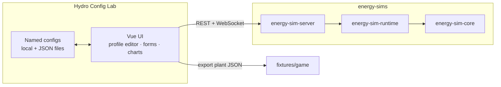
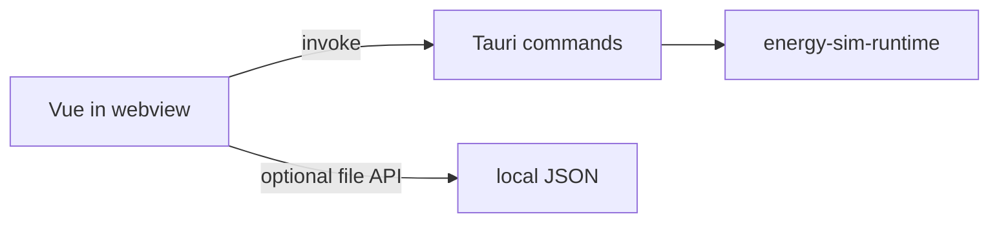

# Hydro Config Lab — Design

**Project:** energy-sims  
**Component:** Stand-alone interactive configuration and trial runner  
**Date:** 2026-07-30  
**Status:** Proposed design (revision 1)  
**Implementation plan:** [plans/hydro-config-lab.md](plans/hydro-config-lab.md)  
**Engine design:** [design.md](design.md)

---

## Purpose

Build a **stand-alone interface** for prototyping hydro (and station) configurations and running them through the **production** Stage 1 engine—not a reimplementation of physics in the browser.

Two product goals:

1. **Game tuning** — Author Clearwater Diversion (and variants) so the fictional campus plant has the head, flow, losses, and power envelope we want in Atomic Adventures. Export plant/session JSON fixtures the game and engine already understand.
2. **Lesson / holo-reader research** — Discover which configuration controls and trial feedback feel *interesting enough* to put in a player-facing holo-reader exercise. The welcome `HydroPowerSimulator.vue` proved one-shot exploration; this lab makes **iteration** easy and keeps results tied to the real engine (ramps, grid, brownout, energy).

This is a **designer / educator / developer tool** first. A polished in-lesson UI may later copy patterns proven here; it is not required to ship inside the game on day one.

---

## Background

### What exists today

| Asset | Role |
| --- | --- |
| `energy-sim-core` / `runtime` | Truth for hydro power, losses, ramps, grid |
| CLI + fixtures | Headless authoring path (edit JSON by hand) |
| `energy-sim-server` | REST create/advance/commands + WebSocket live ticks |
| `clients/js/` | Thin browser client for the server |
| Welcome `HydroPowerSimulator.vue` | Teaching UI with sliders; **separate** JS physics; one-shot feel |

### Pain points the lab addresses

- Editing JSON and re-running the CLI is correct but slow for geometric intuition (“what if more elevation drop?” “more penstock bends?”).
- Slider-only UIs hide **spatial** structure of a penstock run.
- Welcome sim is not wired to production sessions (no ramps, grid, or exportable Stage 1 fixtures).

---

## Goals and non-goals

### Goals

- **Clean-slate site construction** — start empty (or nearly empty); the user places an **intake**, lays the **penstock** path, positions the **turbine / powerhouse**, then fills remaining plant properties.
- Edit layout on a 2D grid: **x = distance along the ground**, **y = elevation**.
- Set stream flow, efficiencies, diameter, dynamics, operator inputs (gate, debris, leakage, online).
- **Save / load / rename** configurations (local first).
- **Submit** config to the engine, run intervals or live ticks, and **watch** power, head breakdown, spin-up, and (when relevant) grid margin / brownout.
- Export standard plant/session JSON usable by CLI, server, and game fixtures.
- Support comparison questions: more head, more bends, drought flow, etc.

### Non-goals (v1)

- Multi-user cloud account system or production auth.
- Database-backed multi-session server (files / localStorage / download JSON are enough).
- Replacing the Atomic Adventures control room (that remains a game host client; **wire the game only after config prototyping settles the engine**).
- Prefilling the lab as a finished Clearwater clone on first open (fixtures may be **import** options, not the default canvas).
- Deep CFD or free-form terrain sculpting beyond a polyline profile.
- Shipping inside the holo-reader on the first cut (research first).

---

## Key decisions

| # | Decision | Rationale |
| --- | --- | --- |
| L1 | **Vue 3 + Vite SPA** for the UI | Matches team preference and welcome stack; fast iteration; Tauri- and Nuxt-friendly later. |
| L2 | **Talk to the production engine** via `energy-sim-server` (REST + WS) for v1 | Same path as the game; no second physics. Localhost is fine for lab use. |
| L3 | **Profile → plant fields** compiled in the UI (or a tiny pure helper) for v1 | Engine already takes `grossHeadM`, `lengthM`, `diameterM`, `frictionFactor`, `minorLossCoefficient`. No core schema change required to start. |
| L4 | **Optional Tauri shell later**, not required for MVP | Desktop packaging and in-process Rust are nice; web lab unblocks tuning sooner. |
| L5 | **Not Electron** | Heavy Chromium bundle; no advantage over Tauri or plain web for this tool. |
| L6 | **Named configs as first-class** | Iteration is the product: save “clearwater-steep”, “drought”, “extra-bends”. |
| L7 | **Keep welcome sim as-is** | Inspiration only; lab does not need to match its slider UX or numbers. |
| L8 | **Clean-slate construction UI** | User builds the site: drop intake → lay penstock → place turbine; not a wall of sliders on a preloaded plant. |
| L9 | **Game wiring after prototyping** | Use the lab to shake out config/engine issues before control-room integration. |
| L10 | **Tests only when they prevent real regressions** | Prefer compiler unit tests and engine-backed checks; no tests for show. |

### Platform choice: web vs Tauri vs Electron

| Option | Fit | Notes |
| --- | --- | --- |
| **Vue SPA + local server** | **Recommended MVP** | `npm run dev` + `cargo run -p energy-sim-server`. Reuses `clients/js/`. Zero packaging. Same API the game will use. |
| **Tauri 2 + Vue** | Strong follow-on | Tiny native webview app; Rust backend can call `energy-sim-runtime` via `invoke` **or** still talk HTTP to a bundled/local server. First-class Vue/Vite support. System file dialogs for save/load. Ideal as a “designer app” double-click tool later. |
| **Nuxt** | Optional | Useful if the lab grows into a multi-page product site. For a single lab tool, Vite SPA is lighter; Tauri docs prefer SPA/SSG over SSR for desktop shells. |
| **Electron** | Not recommended | Dated weight; ships Chromium; weaker fit with a Rust-first engine. |

**Recommendation:** Ship **Vue + Vite web lab** against `energy-sim-server` first. If daily use wants a single desktop binary and native file UX, wrap the **same Vue app** in **Tauri** and optionally add in-process session commands that depend on the existing crates (no duplicate engine).



Later Tauri variant (optional):



---

## User experience

### Primary loop

1. **New configuration** — empty site (or resume a named save). Optional **import** of an existing plant JSON is available but not forced.
2. **Build the plant on the grid** — place **intake**, lay **penstock** segments / bends, place **turbine**.
3. **Fill remaining properties** (flow, diameter, efficiencies, dynamics, operator inputs) as needed.
4. **Steady preview** when geometry is complete enough to compile a plant.
5. **Run a trial** (session start + advance/tick) and watch ramps and power.
6. **Tweak** (more elevation, more bends, lower stream flow) and re-run.
7. **Save** and/or **export** JSON for the game or fixtures.

### Layout sketch

```text
┌──────────────────────────────────────────────────────────────────┐
│  Config: [Untitled ▼]  [New] [Save] [Export] [Import…]  engine ● │
├─────────────────────────────┬────────────────────────────────────┤
│  Site canvas (clean slate)  │  Context / properties              │
│  y elevation (m)            │  Selected: Intake | Bend | Turbine │
│  ▲                          │  Stream, diameter, η, dynamics…    │
│  │                          │  (empty until pieces exist)        │
│  │   (place intake…)        │                                    │
│  │                          │  Live preview (when compilable)    │
│  └──────────────────► x     │  P_e, H_net, warnings              │
│     ground distance (m)     │                                    │
│  Tools: Intake · Penstock · Turbine · Select                     │
├─────────────────────────────┴────────────────────────────────────┤
│  Trial: [▶ Run] [Stop]   (enabled once plant compiles)           │
│  Charts + snapshot strip                                         │
└──────────────────────────────────────────────────────────────────┘
```

### Site construction (x–y grid) — clean slate

The default experience is **constructive**, not “edit a preloaded plant.”

| Piece | Role |
| --- | --- |
| **Intake** | Upstream diversion / headworks. Sets the high elevation reference. |
| **Penstock path** | Ordered intermediate points (bends / grade breaks) between intake and turbine. |
| **Turbine / powerhouse** | Downstream plant. Sets low elevation; ends the penstock. |

**Model (UI):** typed site elements on the plane `(distanceAlongGroundM, elevationM)`, not an anonymous point list only. Under the hood they still compile to ordered profile points + plant fields.

**Minimum complete plant:** intake + turbine (straight penstock). Intermediate bends are optional.

**Derived plant fields (compile step):**

| Engine field | Derivation (v1) |
| --- | --- |
| `penstock.grossHeadM` | \(\max(0,\, z_\mathrm{intake} - z_\mathrm{turbine})\) |
| `penstock.lengthM` | Sum of segment lengths in the x–z plane (ground distance + elevation change per segment) |
| `penstock.minorLossCoefficient` | Base entrance \(K\) + per-bend contribution from turn angle at interior vertices (simple table, author-overridable) |
| `penstock.frictionFactor` / `diameterM` | Author fields (not from geometry) |

Authors can still **override** compiled values (advanced panel) so the lab never blocks hand-tuned JSON.

**Interactions:** tool palette (place intake, place turbine, add bend, select/move/delete); show derived head/length/K when the site is complete enough; optional “ideal teaching” losses (force \(f=0\), \(K=0\)).

**Import path:** loading `fixtures/plants/*.json` (or any plant file) may **reconstruct** a simple two- or three-point profile from gross head/length for editing—or open properties only if geometry is under-specified. First open of the app remains a blank canvas.

### Configuration properties

Expose Stage 1 plant + operator fields from [hydro-physics.md](hydro-physics.md). Prefer **contextual panels** for the selected site element plus a plant-wide section for stream/efficiency/dynamics.

- Stream available flow  
- Diameter, friction factor (sensible defaults once a penstock exists)  
- Turbine / generator efficiency, design/safe flow, rated kW, design rpm  
- Ramp times  
- Operator: gate, debris, leakage, online  

**Station grid / loads:** not part of the default clean-slate canvas. Add later only if trial work needs brownout storytelling; until then keep the lab focused on building and running the **plant**.

Prefer **clear numbers and units** over pure sliders for precision; sliders optional where they help intuition.

### Trials

| Mode | Behavior |
| --- | --- |
| **Steady preview** | `evaluate` / create session without long advance — instant \(P\), head breakdown, warnings |
| **Interval run** | `start` + `advance` N seconds; chart series from history/samples |
| **Live** | WebSocket `/live` ticks; user toggles loads or gate mid-run |

Trial commands the user should feel:

- Open gate → watch spin-up  
- Close gate / stop → spin-down  
- Reduce stream flow (“dry-up”) mid-run  
- Add bends (edit profile, recompile, new trial)  
- Toggle EV charger → margin / brownout  

### Persistence of named configs

v1:

- Browser **localStorage** (or IndexedDB) for quick iteration  
- **Download / upload** plant or full session JSON (engine schema)  
- Optional “copy into `fixtures/plants/`” is a manual or scripted step for repo commits  

Tauri later: native save dialogs and a configs directory next to the app.

---

## Engine integration

### API usage (v1)

Use existing surfaces in [api.md](api.md):

| Lab action | API |
| --- | --- |
| Steady preview | `POST /v1/sessions` with plant/session JSON → snapshot; or short-lived eval via session without start |
| Start trial | `POST .../start` |
| Run interval | `POST .../advance` `{ durationSecs, commands? }` |
| Live | `WS .../live` + `tick` / `command` |
| Loads / operator | `POST .../commands` |
| Export | Client-side serialization of the **authored** config (not only checkpoint) |

Reuse and evolve `clients/js/energySimClient.js` (or a TypeScript port under the lab package).

### Schema extensions (optional, later)

If profile editing becomes first-class for the game:

```json
"penstock": {
  "grossHeadM": 25,
  "lengthM": 180,
  "diameterM": 0.25,
  "frictionFactor": 0.02,
  "minorLossCoefficient": 0.5,
  "profile": {
    "points": [
      { "sM": 0, "zM": 100 },
      { "sM": 80, "zM": 92 },
      { "sM": 160, "zM": 75 }
    ]
  }
}
```

v1 may keep `profile` **lab-only metadata** (strip or nest under a `lab` / `extensions` object) so core validation stays unchanged. Promoting profile into `energy-sim-core` is a follow-on if game configs should retain editable geometry.

---

## Architecture (lab package)

Suggested layout (new package under this repo):

```text
apps/hydro-config-lab/          # or clients/hydro-config-lab/
  package.json
  vite.config.ts
  index.html
  src/
    main.ts
    App.vue
    components/
      ProfileEditor.vue       # x–y canvas / SVG
      PlantForm.vue
      TrialRunner.vue
      SeriesChart.vue
      SnapshotStrip.vue
    lib/
      compileProfile.ts       # points → head, length, K
      configStore.ts          # named configs
      energySimClient.ts      # port of clients/js
    types/
  README.md
```

No change required to Rust crates for MVP. Optional later: Tauri `src-tauri/` sibling that depends on `energy-sim-runtime`.

---

## Teaching and game transfer

| Lab outcome | Transfer target |
| --- | --- |
| Tuned Clearwater plant JSON | `fixtures/plants/`, game facility config |
| “Interesting” control set (few knobs that teach) | Holo-reader lesson design notes / simplified UI |
| Trial scenarios (drought, bends, overload) | Lesson scripts and control-room demos |
| Brownout + ramp feel | Game presentation polish |

The lab intentionally exposes **more** knobs than a player lesson. Part of the work is deciding what to **hide** for the holo-reader after experimentation.

---

## Testing strategy (lab)

Write tests only when they **prevent real regressions**, not for coverage theater.

| Kind | When it earns its keep |
| --- | --- |
| Unit | `compileProfile` / site→plant: head, path length, bend K from known layouts (easy to get wrong) |
| Unit | Config round-trip: lab site model ↔ plant JSON |
| Manual | Export → `energy-sim hydro eval` / `session run` while iterating UX |
| E2E | Only if UI workflows start breaking repeatedly |

Engine correctness remains owned by Rust tests; the lab must not invent alternate physics.

---

## Risks

| Risk | Mitigation |
| --- | --- |
| Profile → K mapping feels arbitrary | Document table; allow manual K override; iterate with Clearwater numbers |
| Authors confuse ground distance with pipe length | Label axes; show both derived length and head prominently |
| Local server friction | Dev script starts server + Vite; document one-command lab start |
| Scope creep into full control-room product | Keep v1 authoring + trial focus; game console stays separate |

---

## Resolved product questions

| # | Question | Decision |
| --- | --- | --- |
| 1 | Default delivery | **Browser-only MVP** (Vue + Vite + local server). Tauri optional later. |
| 2 | Profile fidelity | **Segment polyline** (intake, bends, turbine)—not freehand curves. |
| 3 | Preserve geometry on save | **Yes** — keep editable site/profile metadata so reopen restores the canvas; export still emits valid plant JSON. |
| 4 | Default starting experience | **Clean slate construction** — place intake, lay penstock, place turbine. Not a preloaded station or slider wall. Fixtures are optional import. Grid/loads deferred until plant prototyping needs them. |
| 5 | Game control-room wiring | **After** config prototyping has shaken out the engine. |
| 6 | Automated tests | **Meaningful only** — protect compile/export math and critical regressions; no tests for show. |

---

## References

- [design.md](design.md) — engine architecture  
- [api.md](api.md) — REST / WebSocket  
- [hydro-physics.md](hydro-physics.md) — equations and plant fields  
- [plans/hydro-config-lab.md](plans/hydro-config-lab.md) — build plan  
- Welcome `HydroPowerSimulator.vue` — UX inspiration only  
- [Tauri 2 start](https://v2.tauri.app/start/) — optional desktop shell  
