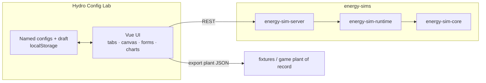

# Hydro Config Lab — Design

**Project:** energy-sims  
**Component:** Stand-alone interactive configuration and trial runner  
**Date:** 2026-08-04  
**Status:** Implemented MVP (revision 2)  
**Engine design:** [design.md](design.md)  
**Remaining work:** [plans/next.md](plans/next.md)

---

## Purpose

A **stand-alone interface** for prototyping hydro configurations and running them through the **production** Stage 1 engine—not a reimplementation of physics in the browser.

Two product goals:

1. **Game tuning** — Author Clearwater Diversion (and variants) so the campus plant has the head, flow, losses, and power envelope we want. Export plant JSON the CLI, server, WASM path, and game fixtures understand. See the **Clearwater plant-of-record workflow** in [design.md](design.md).
2. **Lesson / holo-reader research** — Discover which controls and trial feedback are interesting enough for a player-facing holo-reader exercise. The welcome `HydroPowerSimulator.vue` proved one-shot exploration; this lab makes **iteration** easy and keeps results tied to the real engine (ramps, energy, and eventually grid).

This is a **designer / educator / developer tool**. Player-facing UIs copy patterns proven here; they do not need to ship inside the game on day one.

---

## Status (what shipped)

**Location:** `apps/hydro-config-lab/` (Vue 3 + Vite + TypeScript)

| Area | Status |
| --- | --- |
| Clean-slate site construction (intake / penstock / turbine) | Done |
| Compile site → plant fields (head, length, bend K) | Done (+ unit tests) |
| Equipment properties + teaching-focused defaults | Done |
| Steady preview against `energy-sim-server` | Done |
| Power equation / calculations view | Done |
| Named save (localStorage), export/import JSON, draft resume | Done |
| Trial runner: start/stop, gate spin-up/down, paced charts | Done (REST) |
| Station grid / load toggles in lab | **Not yet** — optional when brownout storytelling is needed in-lab |
| Trial compare / mutation shortcuts | **Not yet** |
| Live WebSocket trials | **Not yet** (REST interval is enough for MVP) |
| Desktop shell (Tauri) | **Out of scope** |

### Workflow UI (as built)

Four tabs, progressive disclosure:

1. **Layout** — Place intake, penstock bends, and turbine on an x–y grid (ground distance vs elevation). Default can start with a minimal complete layout; New resets.
2. **Equipment** — Teaching-focused knobs (intake flow, penstock diameter, overall efficiency) plus room for advanced friction/K overrides; head and length stay derived from Layout.
3. **Calculations** — Steady engine preview, head-loss breakdown, power equation with symbol then numeric steps.
4. **Run** — Server health, timed trial against the engine, live-updating power and speed charts (wall-clock paced advances), Stop / spin-down behavior.

File menu: New, Save / Save as, open named list, Export plant or lab document, Import.

Run notes for developers: [apps/hydro-config-lab/README.md](../apps/hydro-config-lab/README.md).

---

## Background

### What the lab sits on

| Asset | Role |
| --- | --- |
| `energy-sim-core` / `runtime` | Truth for hydro power, losses, ramps, grid |
| CLI + fixtures | Headless authoring and plant-of-record path |
| `energy-sim-server` | REST create/advance/commands (+ WebSocket for later live) |
| `clients/js/` / lab `energySimClient.ts` | Browser client for the server |
| Welcome / game prototypes | Inspiration only; not calculation authorities |

### Pain points the lab addresses

- Editing JSON and re-running the CLI is correct but slow for geometric intuition.
- Slider-only UIs hide **spatial** structure of a penstock run.
- Welcome / legacy game sims are not wired to production sessions.

---

## Goals and non-goals

### Goals (MVP — met)

- Site construction on a 2D grid; compile to engine plant fields.
- Edit major plant parameters; steady preview and timed trials on the production engine.
- Save / load / export / import configurations (local first).
- Export standard plant JSON for CLI and fixture promotion.

### Non-goals

- Multi-user cloud accounts or production auth.
- Database-backed multi-session server for the lab.
- Replacing the Atomic Adventures control room (game host client — after backend readiness).
- Shipping the full lab UI inside the holo-reader (research first; transfer a **reduced** control set).
- Deep CFD or free-form terrain sculpting.
- **Tauri / Electron desktop packaging** — unnecessary; browser + local server is enough.

---

## Key decisions

| # | Decision | Rationale |
| --- | --- | --- |
| L1 | **Vue 3 + Vite SPA** | Matches team stack; fast iteration |
| L2 | **Talk to the production engine** via `energy-sim-server` for the lab | Same physics as game; localhost is fine for designers |
| L3 | **Profile → plant fields** compiled in the UI | Engine already takes head/length/diameter/f/K; no core schema change required for MVP |
| L4 | **No Tauri/Electron** | Web lab unblocks tuning; packaging is not a product need |
| L5 | **Named configs as first-class** | Iteration is the product |
| L6 | **Keep welcome sim as-is** | Inspiration only |
| L7 | **Clean-slate / constructive UI** | User builds the site; fixtures are import options |
| L8 | **Game wiring after host surface is ready** | Lab + WASM session + grid presentation first |
| L9 | **Tests only when they prevent real regressions** | Compile math is protected; no UI appearance tests |
| L10 | **Tab workflow** | Layout → Equipment → Calculations → Run reduces overload vs one dense page |

---

## Architecture

### Site compile (v1)

| Engine field | Derivation |
| --- | --- |
| `penstock.grossHeadM` | \(\max(0,\, z_\mathrm{intake} - z_\mathrm{turbine})\) |
| `penstock.lengthM` | Sum of segment lengths in the x–z plane |
| `penstock.minorLossCoefficient` | Base entrance \(K\) + per-bend contribution (overridable) |
| Diameter, friction, η, dynamics, stream | Author fields on Equipment |

Lab site geometry is preserved in **lab documents** for reopen/edit. Plant export is engine schema (geometry may be reconstructed as a simple profile on import).

### Engine integration (lab)

| Lab action | API |
| --- | --- |
| Steady preview | Create session + snapshot / short-lived eval path |
| Start trial | `POST .../start` |
| Run interval | `POST .../advance` |
| Operator / gate | Commands on the session |
| Export | Client-side serialization of authored config |

---

## Teaching and game transfer

| Lab outcome | Transfer target |
| --- | --- |
| Tuned Clearwater plant JSON | `fixtures/plants/`, station document, game plant of record |
| “Interesting” control set (few knobs) | Holo-reader lesson design / simplified interactive module |
| Trial scenarios (drought, bends, spin-up) | Lesson scripts and control-room demos |
| Grid + brownout feel (when lab loads land) | Control-room grid terminal and facility drama |

The lab intentionally exposes **more** knobs than a player lesson. Part of the work is deciding what to **hide** for the holo-reader after experimentation.

---

## Optional follow-ons (lab product)

Tracked with game readiness in [plans/next.md](plans/next.md):

- Station loads panel (compose grid, toggle loads, see margin/brownout in trials).
- Compare last trials / quick mutations (“+10 m head”, “extra bend”).
- WebSocket live ticks (parity with future hosted console).

---

## Testing strategy (lab)

| Kind | When |
| --- | --- |
| Unit | Site → plant compile (head, length, bend K) |
| Manual | Export → `energy-sim hydro eval` / `session run` |
| E2E | Only if UI workflows break repeatedly |

Engine correctness remains owned by Rust tests.

---

## References

- [design.md](design.md) — engine + integration architecture  
- [api.md](api.md) — REST / WebSocket / WASM  
- [hydro-physics.md](hydro-physics.md) — equations and plant fields  
- [plans/next.md](plans/next.md) — remaining work  
- [apps/hydro-config-lab/README.md](../apps/hydro-config-lab/README.md) — how to run  
